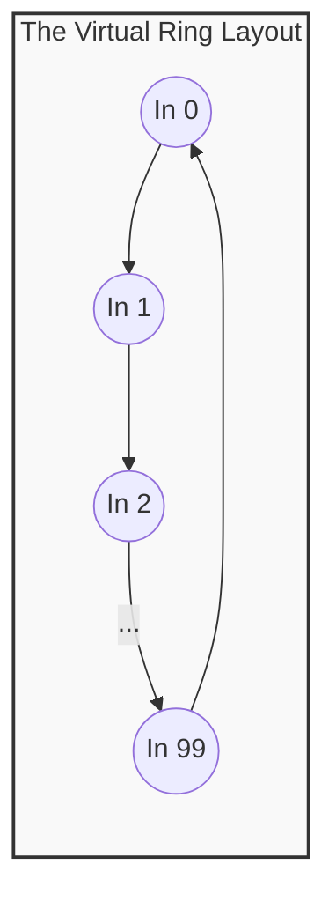

# Designing Highly Routable Interconnection Networks via Cyclic Quorums

> **A 30-Minute Technical Briefing**
> *Author: Wai-Shing Luk*
> *Format: Markdown Presentation*

---

## Slide 1: Title & Overview

### 🛰️ Designing Highly Routable Interconnection Networks via Cyclic Quorums

* **The Challenge:** Connecting a massive set of inputs ($N$) to a smaller set of shared outputs ($M$) without creating routing bottlenecks, timing skews, or massive wiring costs.
* **The Solution:** Leveraging combinatorial block designs, projective geometry, and cyclic quorums to engineer sparse, deterministic crossbars.
* **Objective:** Achieve uniform track density, minimal parasitic $RC$ latency, and predictable physical design implementation.

---

## Slide 2: The Core Problem – The Crossbar Paradox

### 🚧 The Hard Realities of Silicon Scaling

* **The Density Wall:** A full 100-to-24 crossbar requires **2,400 physical junctions (vias)**.
* **The Structural Penalties:**
* 🔴 **Routing Congestion:** Heavy local metal crowding blocks routing tracks for other signals.
* 🔴 **Parasitic Dominance:** Massive wiring capacitance ($C$) and resistance ($R$) cause timing violations.
* 🔴 **Asymmetry Chaos:** Mismatched aspect ratios lead to severe signal skew across the die.


---

## Slide 3: Defining the Cyclic Quorum Solution

### 🧮 What is a Cyclic Quorum System?

* **Definition:** A collection of overlapping subsets (quorums) mapped onto a cyclic group ($\mathbb{Z}_N$).
* **The Intersection Property:** For any two input subsets $Q_A$ and $Q_B$:

$$Q_A \cap Q_B \neq \emptyset$$


* **Physical Translation:** Inputs do not use random paths. They follow a single relative geometric footprint shifted by modular steps.
* **Result:** Guaranteed collision at a shared resource for arbitration with minimal wiring.



---

## Slide 4: Transitioning to True Sparsity

### 💎 Projective Geometry Core

* Avoid massive single-layer grids by using an **Order-3 Projective Plane $(13, 4, 1)$**.
* **The Math:** A $13 \times 13$ matrix using the Singer Difference Set $\mathcal{D} = \{0, 1, 3, 9\} \pmod{13}$.
* **Why it's Optimal:**
* **Sparsity:** Every column has exactly **4 connections**.
* **Efficiency:** Only **52 total vias** ($13 \times 4$) at the core stage.
* **Intersection:** Any two columns intersect at exactly **$\lambda = 1$** point.

```mermaid
gantt
    title 13x13 Core Shift Matrix (4 Vias Per Column)
    dateFormat  X
    axisFormat %s
    section Row 0
    Via 0, 1, 3, 9 :active, 0, 10
    section Row 1
    Via 1, 2, 4, 10 :crit, 1, 11
    section Row 2
    Via 2, 3, 5, 11 :active, 2, 12

```




---

## Slide 5: Modular Network Expansion

### 🧱 Scaling via Tiling & Truncation

* **Horizontal Tiling ($13 \times 13 \rightarrow 39 \times 13$):**
* Copy-paste the $13 \times 13$ macro-cell three times side-by-side.
* Total vias: **156** (compared to 507 in a dense grid).


* **Truncation ($39 \times 13 \rightarrow 38 \times 13$):**
* Slice off the final column (Column 38).
* **Benefits:**
* ✅ **Reuse:** The underlying macro cell design remains identical.
* ✅ **Uniformity:** Columns 0-37 maintain the same electrical and crosstalk profiles.


---

## Slide 6: Handling Coprime Boundaries

### 🔄 Direct Cyclic Rectangular Design ($41 \times 12$)

* When scaling to arbitrary constraints like **$41 \times 12$**, slicing rows is destructive to the math.
* **The Solution:** Map inputs directly to the row space using a direct cyclic shift rule modulo $12$:

$$\text{Row} = (i + d) \pmod{12} \quad \text{for } d \in \{0, 1, 4, 6\}$$


* **The Result:** Since $\gcd(41, 12) = 1$, the connection matrix forms a perfectly uniform diagonal wave across the die layout.
* **Density:** Only **33.3%** (164 total vias).

---

## Slide 7: Python Demo: Design Automation

### 🐍 Modeling & Visualizing the Layout

* **Automation:** Python scripts generate the sparse matrix using modular arithmetic and Difference Sets.
* **Visualization:**
* North-South Columns (Inputs) vs. West-East Rows (Outputs).
* Black dots represent physical vias on a clean white grid.


* **Design-Time Discovery:**
* **Breadth-First Search (BFS):** Used by software to discover optimal multi-hop paths during the design phase.
* **Static Hardcoding:** Once BFS finds the path, it is etched into silicon as a pre-determined look-up table.


```python
# Example logic for Cyclic Shift
for i in range(N_inputs):
    for d in diff_set:
        row_idx = (i + d) % M_outputs
        grid[i][row_idx] = 1 # The 'Black Dot'

```

---

## Slide 8: Why EDA Routers Love Cyclic Quorums

### 🚀 Physical Implementation Benefits

* 🛠️ **Hard-Macro Copy-Paste:** Design a single vertical column template and "stamp" it across the floorplan.
* ⚡ **Metal Layer Stratification:**
* *Local Spans:* Routed on lower, thinner metal layers ($M2/M3$).
* *Global Spans:* High-speed "hyper-chords" on thick, low-resistance top metal layers ($M6/M7$).


* 📉 **Predictable Timing:** No congestion hotspots = matched $RC$ delays across all data channels.

---

## Slide 9: Summary & Takeaways

### 🎯 Key Design Principles

1. **Sparsity Over Density:** Replace dense crossbars with cyclic block matrices to reduce via overhead by up to 80%.
2. **Deterministic Paths:** Use graph-search (BFS) at design-time to discover paths, then hardcode them for zero-latency execution.
3. **Scalable Workflows:** Use **Tiling** and **Truncation** to hit exact specification targets without redesigning the core macro blocks.

> 🔥 **Ready for Silicon Implementation.**
