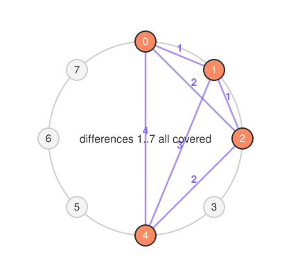
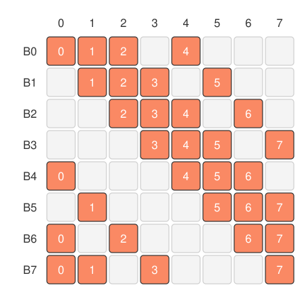
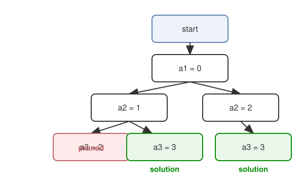
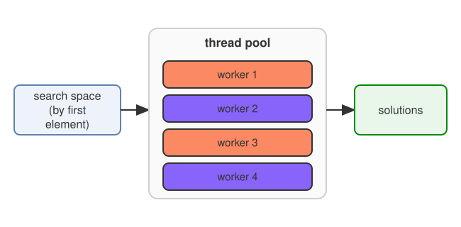
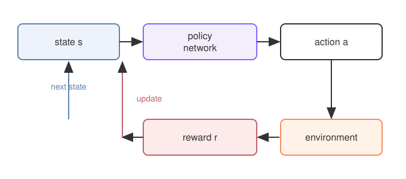

---
title: Finding Optimal Cyclic Quorum Systems by Combinatorial Search and Deep Reinforcement Learning
author: Wai-Shing Luk
bibliography:
  - cyclic_quorum.bib
nocite: '@*'
documentclass: IEEEtran
abstract: |
  This paper studies two computational approaches to finding optimal Cyclic Quorum Systems (CQS). A CQS is a symmetric quorum system in which the whole family of quorums is generated by cyclically shifting a single base quorum, so that equal work and equal responsibility hold automatically. The central difficulty is to identify that base quorum, a problem equivalent to finding a difference cover, or relaxed difference set.

  The first approach is a systematic combinatorial search. It uses generate-and-test with pruning and backtracking, together with symmetry breaking inspired by algorithms for generating fixed-density necklaces and bracelets, and it is guaranteed to find a solution within its search space if one exists. The second approach applies deep reinforcement learning (RL) and treats the problem as a strategic game; unlike the combinatorial method, it is not guaranteed to find a solution within a bounded number of episodes.

  Both methods use parallelism to improve efficiency. The recursive search divides the search space into partitions, each handled by a separate thread, while the RL method runs several agents that learn independently but share a single neural network.
...

## Introduction

Distributed systems must coordinate many independent sites while using resources efficiently. A quorum system is one of the basic tools for this: it is a collection of subsets, called quorums, of the set of sites, in which any two quorums intersect. The intersection property guarantees that any two operations requiring a quorum meet at a common site, which makes conflict detection and resolution possible; it underlies applications such as mutual exclusion and the reliable processing of distributed data.

Designing quorum systems that are both fair and scalable, however, is difficult. Ideally each quorum has the same size (equal work) and each site occurs in the same number of quorums (equal responsibility), and the quorum size is as small as possible in order to reduce communication cost. For $N$ sites satisfying these symmetry conditions the quorum size is approximately $\sqrt{N}$. Attaining this bound is often equivalent to constructing a finite projective plane, and such planes do not exist for every order, so finding optimal quorums is a hard combinatorial problem.

**Cyclic quorum systems (CQS)** are a structured construction that often achieves, or comes close to, these properties. They draw on cyclic block designs and cyclic difference sets, and their defining feature is that the whole family of quorums is generated cyclically from a single base quorum, which simplifies both their description and their management.

Cyclic quorum systems are useful beyond their original application in distributed mutual exclusion. Recent work applies them to complex distributed computations and to resource usage in data-intensive tasks, for example:

- **Distributed All-Pairs Algorithms:** CQS have been successfully applied to problems requiring computations between all possible pairs of data elements in a large dataset, offering significant improvements in memory efficiency and workload distribution [@kleinheksel2016scaling; @kleinheksel2018efficient].
- **Wireless Sensor Networks (WSNs):** A variant called CQS-Pair has been developed for heterogeneous wakeup scheduling in WSNs, enabling nodes with different power-saving requirements to maintain connectivity [@lai2010heterogenous; @jiang2005quorum].
- **Attention Computation in Deep Learning:** CQS-Attention is a novel sequence parallelism scheme leveraging CQS theory to scale the standard self-attention computation for very long sequences in transformer models, addressing the significant memory bottleneck [@bian2025cqs].

The main objective of this paper is to apply difference covers to the construction of optimal cyclic quorum systems. A difference cover is a set of numbers whose pairwise differences, taken modulo $N$, cover every non-zero residue at least once and, ideally, without excessive repetition; the problem is to select exactly $d$ numbers from $\{0, \dots, N-1\}$. Earlier work tabulated base quorums $B_1 = \{a_1, \dots, a_d\}$ (with 1-based indexing) for optimal cyclic quorum schemes with $N$ from 4 to 111; here we extend the search to $N = 150$ and beyond.

This paper considers two computational approaches to finding these structures: a systematic recursive search and a trial-and-error method based on deep reinforcement learning. Both use parallel processing.

The rest of the paper is organized as follows. Section 2 reviews quorum systems and cyclic quorum systems. Section 3 works through a small construction in detail. Section 4 surveys applications, and Section 5 presents the two approaches to finding difference covers and compares them.

## Preliminaries

### Quorum Systems

A quorum system coordinates a distributed system without global knowledge or central control. Let $U = \{P_1, P_2, \dots, P_N\}$ be the set of $N$ sites (or processes).

**Definition 1. Quorum System**
A quorum system $\mathcal{Q}$ over $U$ is a collection of non-empty subsets of $U$, called quorums, which satisfies the **intersection property**: $\forall G, H \in \mathcal{Q} : G \cap H \neq \emptyset$.

This property is essential: it guarantees that any two operations requiring a quorum consult at least one common site, which can mediate conflicts or ensure consistency [@saxena2003survey].

For distributed algorithms such as mutual exclusion, further properties are desirable for fairness and efficiency:

- **A1. Site Inclusion:** Each site $P_i$ is contained in its own quorum $S_i$. This property might be implicitly assumed or explicitly defined depending on the specific application.
- **A2. Non-empty Intersection:** As stated above, any two quorums must intersect. This is the defining property of a quorum system.
- **A3. Equal Work:** All quorums in the system have the same size. If $S_i$ is the quorum for site $P_i$, then $|S_i| = d$ for all $i \in \{1, 2, \dots, N\}$, where $d$ is an integer less than $N$. The size of a quorum is often denoted by $d$ or $k$.
- **A4. Equal Responsibility:** Each site is contained in the same number of quorums. Specifically, for all $P_i \in U$, $P_i$ is contained in $d$ quorums $S_j$.

A set of quorums satisfying properties A3 and A4 is called **symmetric**. The goal in designing efficient quorum systems is to minimize the quorum size $d$ while maintaining these properties.

Maekawa showed that for a fixed quorum size $d$, the maximum possible number of sites $N$ for which a symmetric quorum system exists is $d(d-1) + 1$, assuming any two quorums intersect at exactly one site [@maekawa1985]. This implies a theoretical lower bound on the quorum size:
$d \geq \sqrt{N}$. More precisely, the lower bound is $\lceil \sqrt{N} \rceil$. Grid-based constructions are simpler to describe, but their quorums typically have size about $2\sqrt{N}-1$, roughly twice this bound.

Finding systems that satisfy these properties with a near-minimal size is difficult. For $N = d(d-1)+1$ the problem is equivalent to constructing a finite projective plane of order $d-1$, and such planes do not exist for every order (order 10, for instance). Exhaustive search is intractable for large $N$, which has motivated systematic constructions based on combinatorial designs such as difference sets.

The difficulty of finding optimal symmetric quorum systems for arbitrary $N$ highlights the value of structured constructions that exploit combinatorial structure, such as the cyclic quorum systems discussed next.

### Cyclic Quorum Systems (CQS)

Cyclic quorum systems (CQS) construct symmetric quorum systems from cyclic block designs and cyclic difference sets. Their defining feature is that the entire collection of quorums is obtained by cyclically shifting the elements of a single base quorum.

Let $U = \{0, 1, \dots, N-1\}$ be the set of $N$ sites, viewed as elements in the additive group $\mathbb{Z}_N$.

**Definition 2. Cyclic Quorum System**
A group of cyclic quorums is a set of $N$ quorums $\{B_0, B_1, \dots, B_{N-1}\}$ where each quorum $B_i$ is derived from a base quorum $B_0 = \{a_1, a_2, \dots, a_k\} \subseteq \{0, 1, \dots, N-1\}$ by adding $i$ modulo $N$ to each element: $B_i = \{a_1 + i, a_2 + i, \dots, a_k + i\} \pmod N$.

For $\{B_0, \dots, B_{N-1}\}$ to be a valid quorum system it must satisfy the non-empty intersection property, $B_i \cap B_j \neq \emptyset$ for all $i, j \in \{0, \dots, N-1\}$. The cyclic construction automatically gives equal work ($|B_i| = d$ for every $i$) and equal responsibility (each element occurs in $d$ quorums).

A cyclic quorum system also satisfies the stronger **rotation-closure** property: for all quorums $G, H$ and every integer $i$, $G \cap (H + i) \neq \emptyset$, where $H + i$ denotes the cyclic shift of $H$ by $i$.

The existence and properties of cyclic quorum systems are deeply connected to the theory of **difference sets** [@hall1986combinatorial].

**Definition 3. Cyclic $(N, d, \lambda)$-Difference Set**
A set $M = \{a_1, a_2, \dots, a_d\} \subseteq \{0, 1, \dots, N-1\}$ is called a cyclic $(N, d, \lambda)$-difference set if for every $m \not\equiv 0 \pmod N$, there are exactly $\lambda$ ordered pairs $(a_i, a_j)$ with $a_i, a_j \in M$ such that $a_i - a_j \equiv m \pmod N$.

A related concept, particularly relevant for CQS, is the relaxed difference set.

**Definition 4. Relaxed Cyclic $(N, d)$-Difference Set**
A set $M = \{a_1, a_2, \dots, a_d\} \subseteq \{0, 1, \dots, N-1\}$ is called a relaxed (cyclic) $(N, d)$-difference set if for every $m \not\equiv 0 \pmod N$, there exists at least one ordered pair $(a_i, a_j)$ with $a_i, a_j \in M$ such that $a_i - a_j \equiv m \pmod N$.

More generally, a difference cover with parameters $(v, k, \lambda)$ is a multiset $D$ of elements of a finite abelian group $G$ in which every $z \in G$ occurs exactly $\lambda$ times as a non-trivial difference $z = x_i - x_j$ with $x_i, x_j \in D$. When $G$ is cyclic the cover is called cyclic, which is the case relevant here.

{width="60%"}


The connection between cyclic quorum systems and relaxed difference sets is standard. It can be shown that a set $A = \{a_0, \dots, a_d\} \pmod P$ is a relaxed $(P, d)$-difference set if and only if the cyclic quorum set defined by $S_i = \{a_0 + i, \dots, a_d + i\} \pmod P$ satisfies the non-empty intersection property. The intuition relies on the fact that the intersection property $S_i \cap S_j \neq \emptyset$ for all $i, j$ is equivalent to requiring that for any difference $m = j - i \pmod P$, there exist elements $a_u, a_v \in A$ such that $a_u + i \equiv a_v + j \pmod P$, which simplifies to $a_u - a_v \equiv j - i \pmod P \equiv m \pmod P$. This means every possible non-zero difference modulo $N$ must be formed by at least one pair of elements in the base quorum's set.

Finding a base quorum $B_0$ that forms a cyclic quorum system with the minimum size $d$ is equivalent to finding a relaxed $(N, d)$-difference set with minimum $d$. For cases where $N = d(d - 1) + 1$ and $d-1$ is a prime power, the existence of cyclic $(N, d, 1)$-difference sets (known as Singer difference sets) is guaranteed, and these sets form cyclic quorum systems where any two quorums intersect at exactly one site [@hall1986combinatorial]. Singer difference sets lead to particularly efficient CQS with no redundancy in pair coverage (discussed later). For other values of $N$, finding the optimal base quorum often requires exhaustive search, although methods based on the Multiplier Theorem can speed up the construction of certain types of difference sets. The Multiplier Theorem provides conditions under which a prime $p$ is a "multiplier" of a difference set, meaning multiplication by $p$ permutes the elements of the difference set, aiding in their discovery.

Examples of cyclic quorum systems and difference sets include:

- For $N=7$, the set $\{1, 2, 4\} \pmod 7$ is a cyclic $(7, 3, 1)$-difference set. This is a Singer difference set ($7 = 3(3 - 1) + 1$, $3-1=2$ is prime power). The cyclic quorums are $\{1, 2, 4\}$, $\{2, 3, 5\}$, $\{3, 4, 6\}$, $\{4, 5, 0\}$, $\{5, 6, 1\}$, $\{6, 0, 2\}$, $\{0, 1, 3\}$.
- For $N=8$, the set $\{0, 1, 2, 4\} \pmod 8$ is a base quorum. The quorums are $B_0 = \{0, 1, 2, 4\}$, $B_1 = \{1, 2, 3, 5\}$, $B_2 = \{2, 3, 4, 6\}$, $B_3 = \{3, 4, 5, 7\}$, $B_4 = \{4, 5, 6, 0\}$, $B_5 = \{5, 6, 7, 1\}$, $B_6 = \{6, 7, 0, 2\}$, $B_7 = \{7, 0, 1, 3\}$.
- Table 1 and Table 2 in list base quorums (denoted $B_1$ using 1-based indexing for sites, $B_1=\{a_1, \dots, a_d\}$) for optimal cyclic quorum schemes for $N$ from 4 to 111, found through exhaustive search. For example, for $N=4$, the base quorum is $\{1, 2, 3\}$. For $N=10$, the base quorum is $\{1, 2, 3, 6\}$.

The existence of cyclic quorum systems with sizes close to the theoretical lower bound for arbitrary $N$, coupled with their symmetric properties, makes them attractive for managing distributed resources and computations.

## Example of a Cyclic Quorum System Construction

We construct a cyclic quorum system for $N = 8$ from the base quorum $B_0 = \{0, 1, 2, 4\} \pmod 8$, of size $d = 4$.
The full set of 8 quorums is generated by adding $i \in \{0, 1, \dots, 7\}$ modulo 8 to the elements of $B_0$:

- $B_0 = \{0, 1, 2, 4\} \pmod 8$
- $B_1 = \{0+1, 1+1, 2+1, 4+1\} \pmod 8 = \{1, 2, 3, 5\} \pmod 8$
- $B_2 = \{0+2, 1+2, 2+2, 4+2\} \pmod 8 = \{2, 3, 4, 6\} \pmod 8$
- $B_3 = \{0+3, 1+3, 2+3, 4+3\} \pmod 8 = \{3, 4, 5, 7\} \pmod 8$
- $B_4 = \{0+4, 1+4, 2+4, 4+4\} \pmod 8 = \{4, 5, 6, 0\} \pmod 8$
- $B_5 = \{0+5, 1+5, 2+5, 4+5\} \pmod 8 = \{5, 6, 7, 1\} \pmod 8$
- $B_6 = \{0+6, 1+6, 2+6, 4+6\} \pmod 8 = \{6, 7, 0, 2\} \pmod 8$
- $B_7 = \{0+7, 1+7, 2+7, 4+7\} \pmod 8 = \{7, 0, 1, 3\} \pmod 8$

These eight quorums form a cyclic quorum system for $N = 8$. Each has size 4 (equal work). Equal responsibility also holds: site 0 occurs in $B_0, B_4, B_6$ and $B_7$, that is, in four quorums, matching $d = 4$; by the cyclic construction the same is true of every site. Intersection can be checked on any pair, for instance $B_0 \cap B_1 = \{1, 2\} \neq \emptyset$.

{width="72%"}


The challenge is to find the base quorum $\{a_1, \dots, a_d\}$ for a given $N$ such that the resulting cyclic sets satisfy the intersection property and $d$ is minimal.

### Historical Context of CQS

Cyclic quorum systems were first studied in the context of distributed mutual exclusion, where sites must coordinate access to a shared critical section so that only one site uses it at a time. Maekawa's algorithm was among the first quorum-based algorithms to pursue symmetry (equal work and equal responsibility) with a minimal quorum size, and it pointed out the connection to finite projective planes. As noted above, finding optimal symmetric quorums for arbitrary $N$ proved difficult.

Luk and Wong proposed using cyclic difference sets as a basis for constructing quorum systems for distributed mutual exclusion [@luk1997two]. Their "cyclic" quorum scheme (which forms the basis for the CQS concept discussed here) constructs symmetric quorum sets for arbitrary $N$. The resulting quorum size is shown to be very close to the theoretical lower bound $\sqrt{N}$. The main challenge in this scheme is finding the optimal base quorum (relaxed difference set) through search, although the search space is smaller compared to general exhaustive searches for arbitrary quorum systems.

## Applications

Cyclic quorum systems and difference covers are used well beyond mutual exclusion.

**Distributed mutual exclusion.** A site requests access from every member of its quorum; the members check for conflicts, and the site enters the critical section only when they agree. The quorum size approaches $\sqrt{N}$, and the cyclic construction provides symmetry while requiring only one base quorum.

**Distributed all-pairs algorithms.** Each process stores only a quorum of the data, and the all-pairs property guarantees that every pair of data sets occurs together in some quorum. The quorum size grows as $O(\sqrt{P})$ in the number of processes $P$, which reduces memory substantially; reported experiments give up to a sevenfold speedup on eight nodes with a two-thirds reduction in memory [@kleinheksel2016scaling; @kleinheksel2018efficient].

**Wireless sensor networks.** A variant called CQS-Pair combines two cyclic quorum systems with different cycle lengths to satisfy a heterogeneous rotation-closure property, so that nodes with different power-saving requirements are guaranteed to discover one another within every $m$ consecutive slots. This balances energy consumption against discovery delay [@lai2010heterogenous].

**Attention in deep learning.** CQS-Attention applies the same theory to scale the standard self-attention computation to very long sequences, easing the memory bottleneck [@bian2025cqs].

**String algorithms.** Difference covers also underlie linear-time suffix-array construction: the DC3 algorithm samples positions by residue modulo 3 and uses the difference-cover property that any two positions share a small offset at which both are sample positions, which makes the comparison and merging steps efficient [@karkkainen2006linear; @mehnert2024scalable].

## Finding Difference Covers: Exhaustive Search vs. Deep Reinforcement Learning

In this section, we delve into the difference cover problem, a combinatorial problem that has been studied extensively in the field of mathematics and computer science. The problem is to find a subset of a given set of numbers that, when paired with the original set, covers all possible differences between the numbers.

### The Difference Cover Problem Defined

The difference cover problem asks for a subset of a given size with a covering property. Given the range $0$ to $N-1$ and a required size $d$, we must choose $d$ numbers such that the positive differences between every pair, taken modulo $N$, include every value from $1$ to $N-1$ at least once. Equivalently, place $d$ markers on a circle of $N$ points so that the pairwise distances cover every distance around the circle.

We assume throughout that $N, d \ge 3$ and that $N \le d(d-1)+1$.

### Approach 1: Recursive Search

The first approach is a **systematic algorithm** for finding difference covers, following a **generate-and-test strategy with pruning**.

Solutions are **built incrementally**, one number at a time. Whenever a number is added, the algorithm computes its differences with the numbers already chosen and updates the set of differences seen so far.

{width="85%"}
```{=latex}
\begin{algorithm*}[t]
\caption{Recursive search for a difference cover}
\begin{algorithmic}[1]
\Function{Search}{$N, d$}
  \State $a[1] \gets 0$;\quad $\mathit{cnt} \gets 0$;\quad $\mathit{diff}[\cdot] \gets 0$;\quad $\mathit{diff}[0] \gets 1$
  \State \Call{Recurse}{$1, 1$}
\EndFunction
\Function{Recurse}{$t, \mathit{cnt}$}
  \If{$t = d$}
    \State \Call{Report}{$a$};\quad \Return
  \EndIf
  \For{$v \gets a[t] + 1$ \textbf{to} $N - d + t + 1$}
    \State $a[t+1] \gets v$
    \State $\mathit{cnt}' \gets \Call{StepForward}{t+1, \mathit{cnt}}$
    \If{$\mathit{cnt}' + \mathit{free}(t+1) \ge N-1$} \Comment{coverage bound: else prune}
      \If{$\Call{CheckRev}{t+1} \ne -1$} \Comment{reflection symmetry}
        \State \Call{Recurse}{$t+1, \mathit{cnt}'$}
      \EndIf
    \EndIf
    \State \Call{StepBackward}{$t+1$}
  \EndFor
\EndFunction
\Function{StepForward}{$t, \mathit{cnt}$}
  \For{$j \gets 1$ \textbf{to} $t-1$}
    \State $\delta \gets \min\bigl(a[t]-a[j],\ N-(a[t]-a[j])\bigr)$
    \If{$\mathit{diff}[\delta] = 0$} \State $\mathit{cnt} \gets \mathit{cnt} + 1$ \EndIf
    \State $\mathit{diff}[\delta] \gets \mathit{diff}[\delta] + 1$
  \EndFor
  \State \Return $\mathit{cnt}$
\EndFunction
\end{algorithmic}
\end{algorithm*}
```


### Generating Fixed-Density Necklaces and Bracelets Efficiently

Generating discrete combinatorial objects is important in mathematics and computer science, with applications in computational biology, combinatorial chemistry, operations research and data mining. To be useful, such generation must be efficient; the standard goal is **constant amortized time (CAT)**, where the total work is proportional to the number of objects produced, so that each successive object costs constant time on average.

Among the fundamental objects are strings and their equivalence classes under rotation and reflection. Over an alphabet of size $k$ (here $k = 2$) the two key classes are necklaces and bracelets.

### Combinatorial Objects: Necklaces, Bracelets, and Fixed Density

A **k-ary necklace** is formally defined as a lexicographically minimal k-ary string that is equivalent under string rotation. This means that a string $a_1 a_2 \cdots a_n$ is considered equivalent to any of its rotations, such as $a_i a_{i+1} \cdots a_n a_1 \cdots a_{i-1}$ for $1 < i \le n$. The necklace representation of an equivalence class is the lexicographically smallest string within that class. The set of all $k$-ary necklaces of length $n$ is denoted $N_k(n)$, and its cardinality is $|N_k(n)|$. For example, for $k=2$ (binary strings) and $n=4$, the set of necklaces $N_2(4)$ includes {0000, 0001, 0011, 0101, 0111, 1111}. The rotations of 0011 are {0011, 0110, 1100, 1001}, and 0011 is the lexicographically smallest among them, hence it's the necklace.

A related concept is that of **Lyndon words**, which are aperiodic necklaces. An aperiodic necklace is a necklace that is its own shortest Lyndon prefix. The set of k-ary Lyndon words of length $n$ is denoted $L_k(n)$, with cardinality $L_k(n)$. For instance, $L_2(4) = \{0001, 0011, 0111\}$.

A **prenecklace** is a prefix of some necklace. The set of all $k$-ary prenecklaces of length $n$ is denoted $P_k(n)$, with cardinality $|P_k(n)|$. For example, $P_2(4) = N_2(4) \cup \{0010, 0110\}$.

**Bracelets** are a variation of necklaces that are symmetric under both rotation and reversal. A k-ary bracelet is the lexicographically minimal string equivalent under these two operations. $B_k(n)$ represents the set of length $n$ bracelets, and $B_k(n)$ its cardinality. For a binary example ($k=2$), 001011 is a bracelet because its rotations (e.g., 010110) and reversals (e.g., 001011 reversed is 001101) are considered, and 001011 is the smallest among them.

A critical property for restricted classes of these objects is **fixed density**. A k-ary string is said to be of fixed density if the number of occurrences of symbol 0 is fixed. Let us define density, denoted by $d$, as the number of non-zero symbols. Therefore, a string of length $n$ with density $d$ has $d$ non-zero symbols and $n-d$ zero symbols. The notation for sets of objects with fixed density adds the parameter $d$:

- $N_k(n, d)$: the set of k-ary necklaces having length $n$ and density $d$.
- $P_k(n, d)$: the set of k-ary prenecklaces having length $n$ and density $d$.
- $B_k(n, d)$: the set of k-ary bracelets having length $n$ and density $d$.
Their cardinalities are written $|N_k(n,d)|$, $|P_k(n,d)|$ and $|B_k(n,d)|$.

Counting the number of objects with specific symbol occurrences is possible using formulas. For necklaces with $n_i$ occurrences of symbol $i$, where $0 \le i < k$, the number $N_k(n_0, n_1, \ldots, n_{k-1})$ is given by:
$$
\begin{aligned}
N_k(n_0, n_1, \ldots, n_{k-1}) ={}& \frac{1}{n} \sum_{j \mid \gcd(n_0, n_1, \ldots, n_{k-1})} \\
& \varphi(j)\, \frac{(n/j)!}{(n_0/j)! \cdots (n_{k-1}/j)!}
\end{aligned}
$$
where $\varphi(j)$ is Euler's totient function. The number of necklaces with fixed density $d = n_1 + \cdots + n_{k-1}$ (and thus $n_0 = n-d$) is obtained by summing over all combinations of $n_1, \ldots, n_{k-1}$ that sum to $d$:
$$N_k(n, d) = \sum_{n_1+\cdots+n_{k-1}=d} N_k(n - d, n_1, \ldots, n_{k-1})$$
For binary strings ($k=2$), these formulas simplify. The cardinality of bracelets is related to that of necklaces; specifically, $N_k(n) \le 2B_k(n)$ and $N_k(n, d) \le 2B_k(n, d)$, as there are at most two necklaces in each equivalence class of a bracelet.

Necklaces can also be counted with **Burnside's lemma**, which averages the number of strings fixed by each rotation. Two related objects are Lyndon words (the aperiodic necklaces) and De Bruijn sequences, and many applications require ranking and unranking necklaces and bracelets rather than merely enumerating them.

### Efficient Generation Algorithms: The CAT Goal

The primary performance goal for listing combinatorial objects is achieving a CAT algorithm. This means the total computation time should be linear in the number of objects produced.

Several schemes generate necklaces, Lyndon words and their variants, usually within recursive frameworks such as that of Cattell et al [@cattell2000fast]. Algorithms exist for necklaces with fixed density and content, and for bracelets there are both a linear algorithm (Lisonek) and a CAT algorithm (Sawada) [@sawada2001generating].

### Generating Fixed-Density Necklaces (A Foundation)

The problem of generating fixed-density necklaces efficiently was addressed by Ruskey and Sawada [@ruskey1999efficient]. Their work provides an efficient, simple, recursive algorithm that is optimal in the sense that it runs in time proportional to the number of necklaces produced (i.e., it is CAT). Previous algorithms for this problem were not CAT.

Their approach involves modifying an existing recursive necklace generation algorithm, `Gen(t, p)`, which generates all length $n$ prenecklaces. This algorithm, based on the **Fundamental Theorem of Necklaces**, uses recursion to append characters to a prenecklace while maintaining the prenecklace property. The theorem states that for a prenecklace $\alpha = a_1a_2 \cdots a_{n-1} \in P_k(n-1)$ with $p = \text{lyn}(\alpha)$ (the length of its longest Lyndon prefix), the string $\alpha b \in P_k(n)$ if and only if $a_{n-p} \le b \le k-1$. Furthermore, $\text{lyn}(\alpha b)$ is either $p$ (if $a_{n-p} = b$) or $n$ (if $a_{n-p} < b$). $\alpha b$ is a necklace if $n \bmod \text{lyn}(\alpha b) = 0$.

The base `Gen(t, p)` algorithm generates prenecklaces in lexicographic order and can be modified to output necklaces or Lyndon words by checking the condition on $p$ in the `PrintIt(p)` function.

To generate fixed-density necklaces efficiently, Ruskey and Sawada developed a modified algorithm, `Gen2(t, p)`. This modification focuses on generating prenecklaces whose last character is non-zero, effectively incrementing the density rather than just the length in each recursive step. It uses an array `a` to store the positions of non-zero characters and an array `b` for their values. The parameter `t` represents the current density, and `at` is the length of the current prenecklace. Valid positions and values for the next non-zero character are determined to maintain the prenecklace property and lexicographic order.

Building on `Gen2`, the fixed-density necklace algorithm `GenFix(t, p)` incorporates specific optimizations for the fixed-density constraint. These optimizations include:

1. **Restricting the position of the first non-zero character:** It must be between $n-d+1$ and $(n-1)/d+1$ inclusive.
2. **Restricting the position of the $i$-th non-zero character:** It must be at or before the $(n-d+i)$-th position.
3. **Stopping recursion early:** Stop generating when $d-1$ non-zero characters have been placed. The last non-zero symbol (the $d$-th one) is placed at the $n$-th position during the printing step.
4. **Determining valid values for the $n$-th position:** This is handled in the `PrintIt(p)` function with an additional constant-time test.

The CAT nature of `GenFix` is proven by bounding the size of its computation tree, which consists of prenecklaces ending in a non-zero character with densities from 1 to $d-1$. The size of this tree, CompTree$_k(n, d)$, is bounded by a sum involving the number of such prenecklaces, denoted $P'_k(j, i)$ for length $j$ and density $i$. Lemma 4.1 shows that $P'_k(n, d) \le N_k(n, d) + L_k(n, d)$. Lemmas 4.3 and 4.4 provide bounds relating $N_k(n, d)$ and $L_k(n, d)$ to combinatorial terms and each other, such as $N_k(n, d) \le 2L_k(n, d)$ and $L_k(n, d) \le \frac{1}{n} \binom{n}{d}(k-1)^d$. Using these bounds and inductive proofs, the total computation tree size is shown to be proportional to $N_k(n, d)$, leading to the conclusion that `GenFix` is CAT (Theorem 4.7).

### Generating Fixed-Density Bracelets: Challenges and the Naive Approach

Generating bracelets with fixed density presents additional challenges compared to necklaces. A simple modification of the necklace generation algorithm is a starting point, but it does not immediately yield a CAT algorithm.

A **naive algorithm**, SimpleBFD(t, p, r), can be derived by modifying the necklace generation algorithm (like `Gen(t, p)` or a variant) to list fixed density bracelets. This algorithm needs to ensure two things:

1. All generated prenecklaces must have a density equal to the target density $d$. This requires keeping track of the count of non-zero characters.
2. Only bracelets are listed.

Checking if a string is a bracelet typically involves comparing it to the necklace of its reversed string. A direct implementation of this check takes $O(n)$ time for a string of length $n$, which prevents the algorithm from being CAT.

Instead of a full reversal check, the naive algorithm can utilize Lemma 3.1 from (and). This lemma provides a condition for a necklace $\alpha = a_1a_2 \cdots a_n$ to be a bracelet. If $r$ is the length of the longest prefix such that $a_1 \cdots a_r = a_r \cdots a_1$, then $\alpha$ is a bracelet if and only if $a_{r+1} \cdots a_n \le a_n \cdots a_{r+1}$ and there is no index $t$ such that $a_1 \cdots a_t > a_t \cdots a_1$.

The naive algorithm uses a function `CheckRev(t)` that compares the current prenecklace prefix $a_1 \cdots a_t$ with its reversal $a_t \cdots a_1$. `CheckRev(t)` returns 1 if the prefix is lexicographically less than its reversal, 0 if they are equal, and -1 if it is greater. If `CheckRev(t)` returns -1, further generation from this prenecklace is stopped as it cannot lead to a lexicographically minimal bracelet. If it returns 0 (equal), a parameter $r$ representing the length of the longest equal-to-reversal prefix is updated. When the prenecklace reaches length $n$, the condition $a_{r+1} \cdots a_n \le a_n \cdots a_{r+1}$ is checked.

However, the final comparison $a_{r+1} \cdots a_n \le a_n \cdots a_{r+1}$ at length $n$ still takes $O(n-r)$ time in the naive approach, which is not constant time, preventing it from being a CAT algorithm.

### Towards an Efficient Algorithm for Fixed-Density Bracelets

To achieve a CAT algorithm for generating fixed-density bracelets, the approach is to merge optimizations from two existing CAT algorithms: the fixed-density necklace generation algorithm and the general bracelet generation algorithm.

**Fixed Density Optimizations (from):** As discussed, these optimizations, used in `GenFix`, involve increasing the density (number of non-zero symbols) by one in each main recursive step instead of appending single characters. They use arrays `a` (positions of non-zeros) and `b` (values of non-zeros). Specific density constraints are applied to the positions of non-zero symbols, and recursion stops when $d-1$ non-zeros are placed, handling the last non-zero at position $n$ separately.

**Bracelet Optimizations (from):** These optimizations are aimed at making the reversal check efficient.

1. **Limited Reverse Checks:** Instead of checking all reverse rotations, if a necklace $\alpha$ starts with $i$ identical characters $a$ followed by a different character ($a^i b \ldots$), only specific reverse rotations starting with $a^i$ need to be checked. This check can be done early, but still might take $O(t)$ work for a prenecklace of length $t$.
2. **Incremental Reverse Check:** The final comparison $a_{r+1} \cdots a_n \le a_n \cdots a_{r+1}$ (from Lemma 3.1) is made efficient by starting the comparison once the "middle point" $\lfloor (n-r)/2 \rfloor + r$ is reached. An additional parameter, RS (Reverse Status), is used to store the intermediate comparison results. RS is updated based on comparing the current character $a_{t-1}$ with its corresponding character in the reversed substring $a_{n-t+2+r}$. This makes the comparison a constant time test per recursive call.

### Merging Optimizations and Handling Complexity

The core of the efficient algorithm, named `BraceFD(t, p, r, RS)`, lies in merging these fixed-density and bracelet optimizations. It uses the fixed-density approach of increasing density and using arrays `a` and `b`. It also incorporates the bracelet optimizations, particularly the limited reverse checks and the incremental RS update. The algorithm assumes $0 < d < n$, so strings start with 0. The limited reverse checking (Optimization 1) is applied when the prenecklace has a specific form $0^i b_{i+1} \cdots b_{a_t-i-1} 0^i b_{a_t}$. If the prefix $0^i b_{i+1} \cdots b_{a_t-i-1} 0^i$ is equal to its reversal, $r$ is updated; if the reversal is less, further computation is terminated.

A key challenge in merging the algorithms arises from the fixed-density optimization potentially increasing the prenecklace length by more than one character in a single recursive step (by appending a block of zeros). This makes the simple incremental RS update (Bracelet Optimization 2), which assumes character-by-character appending, non-constant time whenever $a_t - a_{t-1} > 1$.

To address this, the computation of RS is carefully handled. The RS value is computed only when $a_t > (n-r)/2 + r$. If $b_{a_t} \ne b_e$ (where $e = n - a_t + r + 1$), RS can be computed in unit time. If $b_{a_t} = b_e$, it requires checking a substring of zeros. Variables $s_i$ (density of $b_1 \cdots b_i$) and $l_i$ (length of zero substring starting at position $i$) are introduced. The length of the zero substring starting at $e+1$ is $l_{e+1} = a_{s_{e+1}} - a_{s_e} - 1$. RS is then updated based on $b_{a_t}$, $b_e$, and $l_{e+1}$:
$$
\text{RS} = \begin{cases}
  \text{false} & b_{a_t} > b_e, \\
  \text{true} & \begin{aligned}b_{a_t} < b_e \text{ or } \bigl(a_t - a_{t-1} - 1 > l_{e+1}\\ \text{and } b_{a_t} = b_e\bigr).\end{aligned}
\end{cases}
$$
This ensures the RS computation remains efficient.

### The Efficient Algorithm Structure and Correctness

The recursive scheme is `BraceFD(t, p, r, RS)`. An initialization function, `InitFixed()`, is used to set up the initial calls by placing the first non-zero symbol at valid positions (from $n-d+1$ to $(n-1)/d+1$).

The algorithm works by generating strings that belong to the set $N_k(n, d)$ in lexicographic order and eliminating those necklaces whose reversed rotations are lexicographically less than the necklace itself (thus not being the lexicographically minimal representation under reversal).

**Theorem 3.1** states that the function `InitFixed()` lists all elements of $B_k(n, d)$ exactly once in lexicographic order. This proves the correctness of the algorithm.

### Analysis of the Efficient Bracelet Algorithm (Proving CAT)

The analysis aims to show that the `BraceFD` algorithm runs in CAT. This is done by demonstrating that the total number of basic operations is proportional to the number of bracelets generated, $|B_k(n, d)|$.

The computation tree represents the recursive calls. The size of this tree for `BraceFD` is claimed to be proportional to $|B_k(n, d)|$, which is reasonable given $N_k(n, d) \le 2B_k(n, d)$ and the fixed-density necklace algorithm is CAT. Most of the work per recursive call is constant, except potentially for the `CheckRev(t)` function. Therefore, the key is to prove that the total symbol comparisons performed by `CheckRev(t)` throughout the entire algorithm run is proportional to $|B_k(n, d)|$.

The total number of prenecklaces generated by the scheme is proportional to $|B_k(n, d)|$. The cost of symbol comparisons in `CheckRev(t)` is analyzed by showing that each comparison can be mapped to a unique generated prenecklace. For binary bracelets ($k=2$), the comparison logic in `CheckRev(t)` compares $b_j$ with $b_{a_t-j}$. It stops when $j > a_t/2$ or $b_j \ne b_{a_t-j}$. Since there is at most one unequal comparison per prenecklace check, the cost is considered constant per check.

To bound the number of *equal* comparisons (which continue until the middle), a mapping function $f(\beta, j)$ is defined for binary prenecklaces $\beta$ and indices $j$ where the comparison $b_j = b_{a_t-j}$ occurs. This mapping preserves length and content. Lemma 4.1 (in, referring to a lemma in) and Lemma 4.2 prove that this mapping $f$ is one-to-one and maps to valid prenecklaces generated by the algorithm. This establishes that the number of equal comparisons for binary cases is proportional to the number of prenecklaces generated.

For the general case ($k > 2$), the binary mapping $f$ doesn't always produce a valid prenecklace. A more complex mapping $g(\beta, j)$ is introduced, which also preserves length and content. Lemma 4.3 and Lemma 4.4 prove that $g(\beta, j)$ is a valid prenecklace and the mapping $g$ is one-to-one for valid $\beta$ and $j$. This generalizes the result: the total equal comparisons across all prenecklaces generated are proportional to the number of prenecklaces.

Let $P'_k(n, d)$ be the number of prenecklaces generated by the fixed density necklace algorithm, and $C_k(i)$ be the number of equal comparisons made by `CheckRev(t)` on prenecklaces of length $i$. The total number of equal comparisons is $\sum_{i=1}^n C_k(i)$. Lemma 4.4 (in, referring to a lemma in) shows that $P'_k(n, d)$ for prenecklaces not ending in zero is less than $2N_k(n, d)$. Using bounds derived from the necklace analysis, $\sum_{i=1}^{n-1} C_k(i) \le P'_k(n, d)$ and $P'_k(n, d) \le c'N_k(n, d)$ for some constant $c'$. Combining these with $C_k(n) \le 2N_k(n, d)$ and $N_k(n, d) \le 2B_k(n, d)$, the total number of comparisons is bounded: $\sum_{i=1}^n C_k(i) \le (c' + 2)N_k(n, d) \le 2(c' + 2)B_k(n, d) = cB_k(n, d)$ for some constant $c$. This proves **Theorem 4.1**: The total equal comparisons are proportional to $|B_k(n, d)|$. Since all other work per generated prenecklace is constant, the algorithm is CAT. The algorithm is also stated to take asymptotic linear space.

### Conclusion and Future Directions

By merging sophisticated optimizations from fixed-density necklace generation and general bracelet generation, and addressing the complexities arising from their combination (particularly the incremental reverse status update), a CAT algorithm has been developed. The algorithm works for arbitrary alphabet size $k$ and lists all elements of $B_k(n, d)$ exactly once in lexicographic order [@karim2014generating; @sawada2001generating]. The theoretical analysis, involving detailed mapping proofs, confirms that the algorithm achieves Constant Amortized Time performance.

Future work suggested includes exploring applications of this algorithm and developing schemes for listing other restricted classes of bracelets. Open problems mentioned include generating k-ary necklaces with fixed content (where the count of *each* character is fixed) for $k>2$ and counting the number of fixed-density prenecklaces.

The described scheme has been implemented in C and is available from the authors.

In summary, the presented work provides a significant step in the field of combinatorial generation by offering a provably efficient method for listing fixed-density bracelets, objects important in various applications, thereby extending the capabilities of efficient combinatorial algorithms beyond unrestricted or fixed-content cases for this class of structures.

### Finding Difference Covers

A critical technique used is **backtracking**. This means that when the algorithm reaches a **dead end** -- a partial solution that cannot possibly lead to a valid complete solution -- it backs up, undoes the last choice, and tries a different one. The `step_forward` and `step_backward` functions are central to managing this process, updating and reverting the difference counts as the algorithm explores and backtracks through the search space.

**Optimization** is a key aspect of this approach to avoid wasting computational time on impossible solutions. Before exploring deeper into a potential solution path, the algorithm checks whether there are **enough unique differences** covered by the current partial set to possibly reach a valid final answer. If this condition is not met, that path is immediately abandoned (pruned). Arrays are maintained to track seen differences and count unique ones.

The `DcGenerator` class uses three arrays. Array `a` stores the current selection, with `a[D]` as a sentinel; `differences` records which differences have been seen and is initialised to 1, since the difference between a number and itself is 0 and is always covered; and `b` holds auxiliary data.

The `step_forward` function takes the index `t` of the newly added number (`a[t]`) and the current unique `count` of differences. It iterates through the previously selected numbers (`a[j]` for `j < t`), calculates the positive difference (`a[t] - a[j]`) and the modular negative difference (`N - (a[t] - a[j])`), takes the minimum of these two to get the 'diff', increments the count for that 'diff' in the `differences` array, and if this is the first time seeing this 'diff', increments the total unique `count`.

The `step_backward` function mirrors `step_forward`. Given the index `t` of a number being removed, it iterates through previous numbers (`a[j]` for `j < t`), calculates the same 'diff' value as in `step_forward`, and decrements the count for that `diff` in the `differences` array. This effectively reverts the state to before the number `a[t]` was added.

**Illustrative example of step forward and step backward.**

Imagine trying to find a difference cover for $N$=5, D=3.
Start with the first number, typically 0. `a = [0, ?, ?, ?, 5]`.
The first choice is `a`. Let's say the algorithm tries `a = 1`.
Call `step_forward(1, count)`. `a` is 1, `a` is 0.
`p_diff = 1 - 0 = 1`. `n_diff = 5 - 1 = 4`. `diff = min(1, 4) = 1`.
`differences` is incremented. If it was 0, `count` becomes 1.
Now, `a` is `[0, 1, ?, ?, 5]`.
Next, try `a`. Let's say the algorithm tries `a = 3`.
Call `step_forward(2, count)`. `a` is 3.
Check against `a=0`: `p_diff=3`, `n_diff=2`, `diff=2`. `differences` incremented. If it was 0, `count` increases.
Check against `a=1`: `p_diff=2`, `n_diff=3`, `diff=2`. `differences` incremented again.
Current set is {0, 1, 3}. Differences are 1-0=1, 3-0=3, 3-1=2. Modulo 5, these are 1, 3, 2. The negative differences are 0-1=4, 0-3=2, 1-3=3. Modulo 5, these are 4, 2, 3. The unique positive/modular differences are {1, 2, 3, 4}. We need to cover {1, 2, 3, 4} for $N$=5. Here, {1, 2, 3, 4} are covered. This set {0, 1, 3} is a solution.
If {0, 1, 3} wasn't a solution, and the algorithm needed to backtrack from `a=3`, it would call `step_backward(2)`.
`step_backward(2)`: `a` is 3.
Check against `a=0`: `p_diff=3`, `n_diff=2`, `diff=2`. `differences` is decremented.
Check against `a=1`: `p_diff=2`, `n_diff=3`, `diff=2`. `differences` is decremented.
The state is reverted to where only {0, 1} were chosen, and the algorithm tries a different value for `a`.

The `PrintD` function is called when the algorithm reaches a depth where D-1 numbers have been selected (i.e., position `D1`). It performs final validation checks, including ensuring the configuration is "minimal" and checking if the number of unique differences (`count`) is at least `N2` (`N / 2`). If these checks pass, the found difference cover (`a` to `a[D]`) is printed. Note that the modular differences are often considered up to N/2 because if a difference `d` exists, the difference `N-d` also exists between the same two numbers in reverse order. Covering all differences up to N/2 is sufficient to cover all N-1 non-zero differences modulo $N$ for odd $N$, and $N$/2 for even $N$ if the difference $N$/2 is covered. The threshold `N2` is used in the check. The `PrintD` function calls `step_forward` with `D1` to update the final difference counts for the complete set before checking the `N2` condition, and then `step_backward` with `D1` to revert the counts, allowing the search to continue.

Symmetry-breaking optimizations are included, particularly via the `CheckRev` function. This helps to avoid generating and checking equivalent sequences that are simply mirror images or rotations of each other, significantly reducing the search space without missing unique solutions. The `CheckRev` function compares the current partial sequence (`a` up to index `t_1`) with its reversal. It iterates from the second element (`a`) up to the midpoint (`t_1 / 2`) and compares elements `q[j]` with `q[t_1 - j]`. It returns 1 if the current sequence is lexicographically less than its reverse, -1 if greater, and 0 if they are equal up to that point. This optimization is crucial in generating bracelets with fixed density, which is related to the problem being solved. The `BraceFD` and `BraceFD11` functions seem to implement this bracelet generation logic within the difference cover search.

The search is accelerated by using **parallel processing** through a **thread pool**. The work is divided by having different threads **start their searches from different initial values**. The `InitParallel` function initializes the thread pool and enqueues tasks for different starting values `j` within a calculated range (from `(N+1)/2` down to `(N-1)/D+1`). Each task runs an instance of the `DcGenerator` with a specific starting value and calls `Gen11` (or `BraceFD11` in `diff_cover3.cpp`) to begin the recursive generation process for that search partition. Multiple CPU cores work simultaneously on these different partitions of the search space, significantly reducing the total computation time. The main thread waits for these worker threads to complete, displaying a countdown of remaining tasks.

{width="85%"}


We now turn to the complexity of generating fixed-density bracelets. The goal is **constant amortized time (CAT)**: the total work is proportional to the number of objects generated, so each successive object is produced in constant time on average. The paper proves that the optimized algorithm for bracelets with fixed density works in CAT. This is achieved by ensuring that the work done in each recursive call to `BraceFD` to append the next non-zero symbol is constant. While the `CheckRev` function involves comparisons, the paper argues that the total number of symbol comparisons performed by `CheckRev` across the entire generation process is proportional to the number of bracelets generated, thus maintaining the CAT complexity. This proof involves mapping comparisons to unique prenecklaces and showing the mapping is one-to-one, particularly for binary cases and then generalized for k-ary cases using a different mapping `g`. The core idea is that the number of "expensive" operations (like comparisons in `CheckRev`) is bounded by a constant times the number of objects found.

This systematic approach is described as **guaranteed** to find solutions within the defined search space if they exist and if the search is exhaustive. It relies on **explicit pruning rules derived from mathematical properties**.


```{=latex}
\begin{table*}[t]
\centering
\caption{Optimal base quorums for $N = 112$ to $150$.}
\begin{tabular}{rl}
\hline
N & Base quorum \\
\hline
112 & 39 52 56 62 64 76 81 90 97 108 111 112 \\
113 & 47 49 61 68 76 79 87 90 103 107 112 113 \\
114 & 57 60 64 68 72 76 80 81 86 111 112 113 114 \\
115 & 58 61 65 69 73 77 81 82 87 112 113 114 115 \\
116 & 58 61 64 68 72 76 80 84 89 113 114 115 116 \\
117 & 38 44 51 52 56 69 71 80 91 101 114 117 \\
118 & 58 61 63 64 69 75 90 95 99 108 115 117 118 \\
119 & 58 60 65 70 78 86 94 102 110 113 116 117 119 \\
120 & 55 56 66 68 75 82 90 97 114 115 118 119 120 \\
121 & 60 62 67 72 80 88 96 104 112 115 118 119 121 \\
122 & 55 61 62 69 72 79 91 95 107 111 116 120 122 \\
123 & 54 56 70 73 75 84 90 97 107 115 119 122 123 \\
124 & 54 59 71 75 79 86 93 99 112 121 122 123 124 \\
125 & 55 60 72 76 81 87 94 100 114 122 123 124 125 \\
126 & 50 52 56 62 65 82 87 92 103 110 111 125 126 \\
127 & 54 60 64 76 78 83 91 106 116 117 123 126 127 \\
128 & 53 57 63 66 68 78 92 100 101 108 109 127 128 \\
129 & 50 58 59 65 68 88 93 98 110 112 114 125 129 \\
130 & 47 51 59 61 72 85 90 91 100 107 124 127 130 \\
131 & 56 58 70 77 85 88 97 105 108 121 125 130 131 \\
132 & 66 69 72 76 80 84 88 92 96 101 129 130 131 132 \\
133 & 48 57 58 65 78 90 93 104 109 127 131 133 \\
134 & 67 69 73 76 82 92 102 112 122 126 129 130 133 134 \\
135 & 68 71 72 76 79 89 99 109 119 121 128 133 134 135 \\
136 & 68 71 73 77 80 90 100 110 120 121 128 134 135 136 \\
137 & 69 72 74 78 81 91 101 111 121 122 129 135 136 137 \\
138 & 65 69 76 83 93 103 113 123 126 129 132 134 135 138 \\
139 & 65 72 73 79 80 90 100 110 120 123 132 134 136 139 \\
140 & 62 67 79 83 87 91 98 105 111 128 137 138 139 140 \\
141 & 68 75 79 86 96 106 116 126 129 132 135 138 140 141 \\
142 & 63 66 80 82 84 92 95 104 107 134 135 140 141 142 \\
143 & 57 72 77 78 91 95 99 103 107 131 133 140 142 143 \\
144 & 56 66 67 69 76 84 98 106 114 118 120 139 141 144 \\
145 & 59 68 69 79 86 90 94 98 102 126 139 140 142 145 \\
146 & 59 66 71 79 80 90 93 99 103 128 129 144 145 146 \\
147 & 64 66 78 85 93 96 104 113 121 124 137 141 146 147 \\
148 & 56 61 62 80 88 95 106 110 112 126 135 138 147 148 \\
149 & 56 61 63 77 90 101 107 113 116 126 136 144 148 149 \\
150 & 51 63 66 69 70 96 98 106 111 119 128 130 144 150 \\
\hline
\end{tabular}
\end{table*}
```
### Approach 2: Reinforcement Learning (RL Implementation)

The second approach treats the problem as a **strategic game** and solves it with **reinforcement learning (RL)**, in which a program learns by trial and error, much as one learns a video game by experimenting and improving.

At the heart of this RL implementation is an **artificial "brain" called a PolicyNetwork**. This is a neural network designed for decision-making. The PolicyNetwork has **three layers of artificial neurons**.

- The **first layer (Input Layer)** receives information about the **current state of the puzzle**.
- The **middle layers (Hidden Layers)** process this information.
- The **final layer (Output Layer)** makes the decision on **which number to pick next**.

The policy network starts from essentially random decisions and **improves over time by reinforcing what worked**. The weights and biases of the network are initialized using **Xavier initialization**, a technique mentioned as helping to maintain variance of activations across layers for better training. ReLU (Rectified Linear Unit) activation is applied in the hidden layers.

The program plays the difference-cover game many times, potentially thousands; each attempt is called an **episode**.

1. **State Representation**: In each step of an episode, the AI observes the **current situation** of the puzzle. This situation includes which numbers have already been picked and which mathematical differences have been covered so far. This information is converted into a numerical format, specifically a **"state vector"**. The state vector has a size of 2\*N: N elements representing which numbers are chosen (1 if chosen, 0 otherwise) and N elements representing which residues/differences are covered (1 if covered, 0 otherwise).

    **Illustrative example of a state vector.**

    Imagine N=5, D=3. Suppose {0} is chosen initially.
    Chosen vector (size 5): `Residues covered (size 5):` (only difference 0 is covered initially, modulo 5)
    State vector (size 10): `[1.0f, 0.0f, 0.0f, 0.0f, 0.0f, 1.0f, 0.0f, 0.0f, 0.0f, 0.0f]` (concatenation)

    If the AI then chooses number 1.
    Chosen vector: `Differences between 0 and 1: 1-0=1 (diff 1), 0-1=-1 (mod 5 is 4). Residues covered: difference 0 (from 0-0, 1-1), difference 1 (from 1-0), difference 4 (from 0-1). Residues vector:`
    New State vector: `[1.0f, 1.0f, 0.0f, 0.0f, 0.0f, 1.0f, 1.0f, 0.0f, 0.0f, 1.0f]`

2. **Decision Making**: The PolicyNetwork takes the state vector as input and performs a **forward pass**. It processes this information through its layers and calculates raw scores called **"logits"** for picking each of the N possible numbers. These logits are then converted into **probabilities** for picking each remaining number using the **Softmax function**. Numbers that the network considers more promising receive higher probabilities. Crucially, already chosen numbers are masked by setting their logits to a very low value before applying softmax, ensuring they are not selected again.

    The Softmax function is defined as:
    $$ \text{Softmax}(z_i) = \frac{e^{z_i - \max(z)}}{\sum_j e^{z_j - \max(z)}} $$
    where $z_i$ are the logits, and $\max(z)$ is the maximum logit for numerical stability. This function outputs a probability distribution over the possible actions (picking a number).

3. **Action Selection**: The AI then **randomly selects a number (action)** based on the probabilities generated by the network. Random selection based on probabilities allows the AI to **explore different strategies** rather than always picking the seemingly best option, which is important for learning. The selection is done using a discrete distribution based on the calculated probabilities.

4. **Reward Calculation**: After selecting a number and updating the puzzle state (marking the number as chosen, updating covered residues), the AI receives a **"reward"**. This reward is based on **how many new mathematical differences this choice covers**. More new coverage results in a better (higher) reward. This immediate reward signal guides the learning process.

5. **Learning**: After completing a full episode (attempting to pick D numbers), the AI analyzes what happened. If the episode led to finding a solution, or if certain actions or sequences of actions resulted in good cumulative rewards, the PolicyNetwork **adjusts its internal parameters (weights and biases)** to make similar decisions more likely in the future. This adjustment involves calculating **"gradients"** -- mathematical measures of how much each weight and bias should change to improve performance. These gradients are computed using a policy gradient method, working backward from the episode's outcomes and rewards. The rewards collected during the episode are typically aggregated into **"discounted returns"**, which account for future potential rewards, often using a discount factor (GAMMA). These returns are then normalized for more stable training.

The core update rule for network parameters (like weights W or biases b) based on gradients (gradW or gradB) and the learning rate is described as:
{\small
$$\text{parameter} = \text{parameter} - \text{LEARNING RATE} \times \text{gradient}$$
}

This update process, specifically shown for weights and biases of the three layers (`W1, b1, W2, b2, W3, b3`), is performed by the `policyNet.update` method.

As in the recursive search, the learning is accelerated with **multi-threading**. Multiple **"worker threads"** are run simultaneously. Each worker thread is like an independent AI agent trying to solve the puzzle. Crucially, **they all share the same PolicyNetwork (brain)** and learn from each other's experiences by contributing their calculated gradients to update the shared network. This parallel approach significantly speeds up the discovery process.

The `workerThread` function encapsulates the logic for a single thread. Each thread runs a loop that continues as long as no solution has been found by any thread and the total episode count across all threads is below `MAX_EPISODES`. Inside the loop, a thread increments the shared episode counter, initializes the puzzle state, interacts with the "environment" (picks numbers) for D-1 steps, stores the states, actions, and rewards experienced during the episode. After the episode, it checks if a solution was found. If yes, it uses a **mutex (`outputMutex`)** to safely print the solution and set a shared `solutionFound` flag. If not a solution, it calculates discounted returns, normalizes them, computes the gradients for the network parameters based on the policy gradient method, and then uses a **mutex (`networkMutex`)** to safely update the shared PolicyNetwork with these gradients. The mutexes (`networkMutex` and `outputMutex`) are essential for thread safety, ensuring that shared resources (the neural network parameters and the output stream) are accessed and modified by only one thread at a time.

{width="85%"}
```{=latex}
\begin{algorithm*}[t]
\caption{Reinforcement-learning episode and policy-gradient update}
\begin{algorithmic}[1]
\Function{Episode}{$N, d, \pi_\theta$}
  \State $s \gets [\mathbf{0}_N, \mathbf{0}_N]$;\quad store $s_0$
  \For{$k \gets 1$ \textbf{to} $d-1$}
    \State $z \gets \pi_\theta(s)$;\quad $p \gets \operatorname{softmax}(z)$ with chosen numbers masked
    \State sample $a_k \sim p$
    \State $r_k \gets$ number of new differences covered by $a_k$
    \State update $s$ from $a_k$;\quad store $s_k, a_k, r_k$
  \EndFor
  \State \Return the trajectory $(\ldots, s_k, a_k, r_k, \ldots)$
\EndFunction
\Function{Update}{$\{r_k\}$}
  \State $G_k \gets \sum_{i \ge k} \gamma^{\,i-k} r_i$;\quad normalise
  \State $\theta \gets \theta + \eta \sum_k G_k\, \nabla_\theta \log \pi_\theta(a_k \mid s_k)$
\EndFunction
\end{algorithmic}
\end{algorithm*}
```


The `findDifferenceCoverRL` function orchestrates the parallel RL process. It initializes the PolicyNetwork, creates shared atomic variables (`episodeCounter`, `solutionFound`) and the output mutex, launches the specified number of `NUM_THREADS` worker threads, and waits for them to finish using `join()`. Finally, it reports if no solution was found after exhausting the `MAX_EPISODES` limit.

This approach is **learned**: it develops a strategy from experience. Unlike the systematic search it is **not guaranteed** to find a solution, especially within a limited number of episodes (`MAX_EPISODES`), and it learns to find *a* solution rather than all of them. Its success depends on **discovering good strategies from the reward signal**.


```{=latex}
\begin{table*}[t]
\centering
\caption{Nearly optimal base quorums found by the reinforcement-learning agent for $N = 151$ to $171$.}
\begin{tabular}{rl}
\hline
N & Base quorum \\
\hline
151 & 0 3 7 34 48 59 60 80 82 103 121 122 126 132 134 141 150 \\
152 & 0 4 7 10 61 62 69 80 81 99 102 116 118 125 128 130 141 \\
153 & 0 1 5 6 12 40 60 62 80 88 95 98 109 112 128 131 140 \\
154 & 0 16 21 27 31 40 48 62 73 77 98 116 125 127 128 141 147 \\
155 & 0 6 24 40 41 53 64 80 83 101 115 120 126 131 146 151 153 \\
156 & 0 10 22 39 72 81 88 90 102 105 109 116 141 143 146 147 148 \\
157 & 0 2 14 15 19 30 52 67 102 103 109 110 112 132 133 153 155 \\
158 & 0 12 16 23 29 33 34 37 60 69 79 84 99 110 112 117 138 \\
159 & 0 25 53 58 65 77 80 84 97 98 100 106 108 118 147 148 154 \\
160 & 0 2 9 10 22 41 64 65 75 79 90 93 106 109 114 115 123 \\
161 & 0 21 37 38 39 45 56 58 60 67 71 81 131 143 146 151 158 \\
162 & 0 13 14 15 16 40 50 53 55 59 63 67 78 139 144 146 155 \\
163 & 0 20 25 36 71 81 85 93 101 102 104 107 119 136 143 156 160 \\
164 & 0 9 29 56 67 68 82 86 88 89 114 119 129 130 137 154 160 \\
165 & 0 9 19 31 58 63 80 82 122 124 128 130 133 137 151 158 164 \\
166 & 0 3 11 19 31 59 66 73 76 83 116 133 139 143 144 146 148 \\
167 & 0 17 18 20 41 49 54 63 79 86 94 96 98 100 146 156 158 \\
168 & 0 2 15 39 42 60 70 76 77 81 86 106 117 127 129 135 149 \\
169 & 0 10 31 44 56 74 76 87 94 96 99 100 115 136 144 152 166 \\
170 & 0 22 36 43 45 46 51 70 91 103 107 111 120 131 138 141 164 \\
171 & 0 4 17 25 27 36 56 60 72 100 106 118 121 122 145 159 164 \\
\hline
\end{tabular}
\end{table*}
```

Table III compares the quorum size found with the lower bound.

```{=latex}
\begin{table*}[t]
\centering
\caption{Quorum size $d$ found by the search compared with the lower bound $\lceil\sqrt{N}\rceil$ for selected $N$. Rows with $N \le 150$ are optimal (recursive search); the rest are nearly optimal (reinforcement learning).}
\begin{tabular}{rrrr}
\hline
$N$ & $d$ & $\lceil\sqrt{N}\rceil$ & $d/\lceil\sqrt{N}\rceil$ \\
\hline
112 & 12 & 11 & 1.09 \\
120 & 13 & 11 & 1.18 \\
130 & 13 & 12 & 1.08 \\
140 & 14 & 12 & 1.17 \\
150 & 14 & 13 & 1.08 \\
160 & 17 & 13 & 1.31 \\
171 & 17 & 14 & 1.21 \\
\hline
\end{tabular}
\end{table*}
```

### Common Elements and Key Differences

Both the recursive search and the reinforcement learning approaches share a fundamental strategy for efficiency: they **utilize parallel processing**. Both employ worker threads (or a thread pool) to significantly speed up their respective processes, whether that's exploring different starting points in a search space or running multiple learning agents simultaneously.

Their core methodologies, however, are quite different:


```{=latex}
\begin{table*}[t]
\centering
\caption{Comparison of the two approaches.}
\begin{tabular}{@{}p{0.16\linewidth}p{0.38\linewidth}p{0.38\linewidth}@{}}
\hline
Feature & Recursive search & Reinforcement learning \\
\hline
\textbf{Approach} & Systematic, algorithmic search & Trial and error, from experience \\
\textbf{Guarantee} & Guaranteed, if the search is exhaustive & May not find a solution within the episode limit \\
\textbf{Discovery} & Explicit pruning rules & Strategies learned from rewards \\
\textbf{Core logic} & Recursive calls & A neural network \\
\hline
\end{tabular}
\end{table*}
```
The recursive search systematically explores combinations using backtracking and predefined mathematical rules for pruning branches of the search tree that cannot lead to a solution. The RL approach, conversely, learns through interaction with the problem, adjusting a neural network's parameters based on trial and error guided by rewards.

### Implementation Notes and Performance

Several engineering issues arose in the implementation and are worth recording, because two of them turned out to be bugs rather than tuning.

**Symmetry pruning.** The original search broke only rotation symmetry (necklaces). Adding the reflection test `CheckRev` reduces it to bracelets, but the gain is modest: reflection only helps near the symmetric frontier, so the measured speedup is 1.07-1.17x. The output was checked on twelve parameter pairs ($N$ from 15 to 105) and is identical to the reference solver.

**A silent reinforcement-learning bug.** In one implementation the logit gradient was computed into a local vector and then discarded, so the parameter update subtracted zero from every weight. The agent was, in effect, a fixed random policy: the mean residue coverage stayed flat at about 12.3 over 40000 episodes at $N = 15$, $d = 5$. Using a genuine policy gradient raises it to about 13.9.

**Entropy-bonus sign.** A second bug had the wrong sign on the entropy bonus, which minimises entropy and collapses the policy. Correcting the sign changed the solution-finding rate at $N = 31$, $d = 6$ from 5/16 to 11/16 trials.

**Efficiency.** Two changes sped up the RL solver: caching the activations during an episode instead of re-running the forward pass during backpropagation, and reusing per-thread buffers across episodes. Together they give a 1.48x single-thread speedup. Removing the mutex around the shared-network update, in the style of asynchronous (Hogwild) SGD, gives 9.5x on ten threads; the resulting data race is deliberate, documented, and relies on tear-free aligned floating-point stores.

**Robustness.** The input guard $N \le d(d-1)+1$ was computed in 32-bit arithmetic and overflowed for large $d$; computing the product in 64-bit, and bounding $N$, fixes it. The command-line interface was fuzzed with degenerate and overflow inputs, all of which are now rejected cleanly, and the binaries were rebuilt with standard-library bounds assertions enabled, without observing any out-of-range access.


```{=latex}
\begin{table*}[t]
\centering
\caption{Summary of the implementation changes and their measured effects.}
\begin{tabular}{p{0.30\linewidth}p{0.64\linewidth}}
\hline
Change & Effect \\
\hline
Bracelet symmetry & 1.07-1.17x, identical output \\
Real backpropagation & coverage $12.3 \to 13.9$ \\
Entropy sign fix & 11/16 vs 5/16 solved \\
Cache and buffer reuse & 1.48x single-thread \\
Lock-free update & 9.5x on 10 threads \\
Overflow-safe guard & no crashes or out-of-range access \\
\hline
\end{tabular}
\end{table*}
```
### Conclusion

Finding difference covers is a combinatorial problem with practical applications, and two distinct parallel approaches have been presented. The recursive search is systematic and guaranteed: it exploits mathematical structure and pruning to explore the solution space efficiently, using parallel processing across search partitions. The reinforcement learning approach, on the other hand, frames the problem as a game and learns a strategy through trial and error guided by rewards, using a neural network as its decision-making core and accelerating learning through parallel worker threads sharing the same network. While the recursive method guarantees finding solutions if they exist within its search space, the RL method offers a learned approach that may discover solutions but is not guaranteed to find one within a fixed number of attempts. Both demonstrate the power of parallel computation in speeding up complex search and learning processes.

\clearpage

## References {.unnumbered}

W.-S. Luk and T.-T. Wong, ''Two new quorum based algorithms for distributed mutual exclusion,'' in Proc. 17th Int. Conf. Distrib. Comput. Syst., 1997, pp. 100--106.

C. J. Kleinheksel and A. K. Somani, ''Scaling distributed all-pairs algorithms,'' in Proc. Int. Conf. Inf. Sci. Appl., 2016, pp. 247--257.
Marshall Hall, Jr., Combinatorial Theory, chapter 11, John Wiley & Sons, 1986.

A. Reverter and E. K. Chan, ''Combining partial correlation and an information theory approach to the reversed engineering of gene co-expression networks,'' Bioinf., vol. 24, no. 21, pp. 2491--2497, 2008.

Y. Bian and A. K. Somani, "CQS-Attention: Scaling Up the Standard Attention Computation for Infinitely Long Sequences," IEEE Access, vol. 13, pp. 3544550-3544563, 2025.

M. Maekawa, ''A $\sqrt{N}$ algorithm for mutual exclusion in decentralized systems,'' ACM Trans. Comput. Syst. (TOCS), vol. 3, no. 2, pp. 145--159, 1985.

C. J. Kleinheksel and A. K. Somani, ''Efficient distributed all-pairs algorithms: Management using optimal cyclic quorums,'' IEEE Trans. Parallel Distrib. Syst., vol. 29, no. 2, pp. 391--404, Feb. 2018.

Shouwen Lai, Bo Zhang, Binoy Ravindran, and Hyeonjoong Cho, "CQS-Pair:
Cyclic Quorum System Pair for Wakeup Scheduling in Wireless Sensor Networks", Systems Software Research Group.

Cory J. Kleinheksel and Arun K. Somani, "Scaling Distributed All-Pairs Algorithms: Manage Computation and Limit Data Replication with Quorums".

## Bibliography {.unnumbered}
