# Finding Optimal Cyclic Quorum Systems

### A Tale of Two Algorithms: Combinatorial Search & Deep Reinforcement Learning

---

## The Challenge: Keeping Things in Sync 🤝

In a distributed system, multiple computers (nodes) need to coordinate without a central boss.

**A classic problem:** Mutual Exclusion. How do we ensure only one node accesses a shared resource at a time?

Think of it like a digital talking stick. 🎤

---

## A Solution: Quorum Systems 💡

A **Quorum System** is a set of subsets (called *quorums*) of all the nodes.

**The Golden Rule (Intersection Property):** Any two quorums **must** have at least one node in common.

$$
\forall G, H \in \mathcal{Q} : G \cap H \neq \emptyset
$$

This shared node acts as a mediator to prevent conflicts.

---

### Visualizing a Quorum

Any process needing access must get permission from a full quorum. The intersection guarantees coordination!

---

### What Makes a *Good* Quorum System?

We want fairness and efficiency:

1.  **Equal Work:** All quorums have the same size, $d$.
2.  **Equal Responsibility:** Every node is part of the same number of quorums.

A system with these properties is called **symmetric**.

**The Goal:** Find a symmetric system with the smallest possible quorum size, $d$.

The theoretical best is $d \approx \sqrt{N}$, where $N$ is the total number of nodes.

---

## A More Elegant Way: Cyclic Quorum Systems (CQS) 🚲

CQS provides a simple, structured way to build powerful, symmetric quorum systems.

**The Idea:**
1.  Define **one** special "base quorum", $B_0$.
2.  Generate all other quorums by cyclically "shifting" the base quorum.

$$
B_i = B_0 + i \pmod N = \{a_1+i, a_2+i, \dots, a_d+i\} \pmod N
$$

This automatically guarantees the "Equal Work" and "Equal Responsibility" properties!

---

### CQS Example: N=7, d=3

Let the base quorum be $B_0 = \{0, 1, 3\}$.

*   $B_1 = \{0+1, 1+1, 3+1\} = \{1, 2, 4\}$
*   $B_2 = \{0+2, 1+2, 3+2\} = \{2, 3, 5\}$
*   $B_3 = \{0+3, 1+3, 3+3\} = \{3, 4, 6\}$
*   ...and so on.

---

## The Core Puzzle: Finding the Base Quorum 🧩

For CQS to work, the base quorum $B_0 = \{a_1, \dots, a_d\}$ must satisfy the intersection property.

This boils down to a fascinating combinatorial puzzle: $B_0$ must be a **Difference Cover**.

**Difference Cover:** The set of all possible differences between pairs of elements in $B_0$ (modulo N) must include every number from $1$ to $N-1$.

$$
\forall m \in \{1, ..., N-1\}, \exists a_i, a_j \in B_0 \text{ s.t. } a_i - a_j \equiv m \pmod N
$$

**This is the hard part!** How do we find this magic set?

---

## Approach #1: Systematic Combinatorial Search 🧠

This approach is a methodical, brute-force search with clever optimizations.

*   **Method:** Generate-and-test with backtracking.
*   **Analogy:** Like solving a Sudoku puzzle by trying numbers and backtracking when you hit a dead end.

```mermaid
graph TD
    A[Start with empty set] --> B{Pick next number};
    B --> C{Check if partial solution is still valid};
    C -- Yes --> D{Goal Reached?};
    C -- No --> E[Backtrack: Undo pick];
    D -- No --> B;
    D -- Yes --> F[Solution Found! 🎉];
    E --> B;
```

---

### Search Optimizations

1.  **Pruning:** If a partial set can't possibly form a full difference cover, abandon that path immediately.
2.  **Symmetry Breaking:** The problem has symmetries (like rotations and reflections). We use techniques from generating "combinatorial bracelets" to avoid checking equivalent solutions.
3.  **Parallelism:** We use a **thread pool** to divide the massive search space. Each thread starts searching from a different initial number.

✅ **Guarantee:** This method is guaranteed to find the optimal solution if one exists.

---

## Approach #2: Deep Reinforcement Learning 🤖

A completely different idea: let's teach an AI to solve the puzzle!

*   **Method:** Frame the problem as a strategic game.
*   **The Player:** An AI agent (a `PolicyNetwork`).
*   **The Goal:** The agent "plays" the game thousands of times, learning from trial and error what a good solution looks like.

---

### The Reinforcement Learning Loop

```mermaid
graph TD
    subgraph RL Loop
        State["Current State<br>(Chosen numbers, covered differences)"]
        Agent(🤖 Policy Network)
        Action[Pick a Number]
        Reward[🏆<br>How many NEW differences were covered?]

        State -- Input --> Agent;
        Agent -- Output --> Action;
        Action -- Update --> State;
        Action -- Generates --> Reward;
        Reward -- Learn --> Agent;
    end
```

The agent gets rewarded for making good moves and adjusts its strategy (`PolicyNetwork` weights) to get more rewards in the future.

---

### RL Optimizations

*   **Shared Brain:** We run multiple agents (threads) in parallel.
*   Crucially, they all share and update the **same neural network**.
*   This allows them to learn from each other's successes and failures, dramatically speeding up the learning process.

❌ **No Guarantee:** This method is not guaranteed to find a solution. But it's fantastic for exploring huge search spaces where a systematic search would be impossible.

---

## Results 📊

We successfully used both methods to find optimal and near-optimal cyclic quorums.

**Combinatorial Search:** Extended the known table of optimal quorums from N=111 up to N=150.

| N   |  Optimal Base Quorum (1-based) |
|:---:|:-------------------------------|
| 112 |  39  52  56 ... 112            |
| 113 |  47  49  61 ... 113            |
| ... | ...                            |
| 150 |  51  63  66 ... 150            |

**Reinforcement Learning:** Found high-quality solutions for N > 150, where search becomes too slow.

---

## Conclusion

We explored two powerful and distinct approaches to solve the Difference Cover problem for constructing Cyclic Quorum Systems.

| Approach | Method | Guarantee | Key Feature |
|:---:|:---:|:---:|:---:|
| **Search** | Systematic & Algorithmic | ✅ Yes | Intelligent Pruning |
| **RL** | Learned via Trial & Error | ❌ No | Adaptive Strategy |

Both methods leverage **parallel processing** to tackle this computationally hard problem, demonstrating how classic algorithms and modern AI can work to solve complex challenges in distributed computing.

---

# Thank You!

## Questions!
