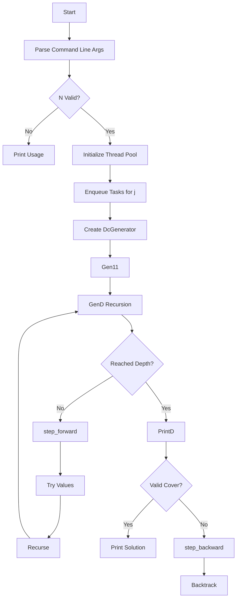
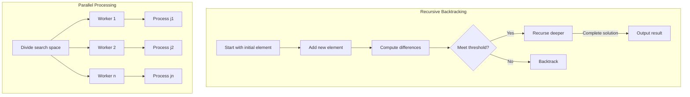
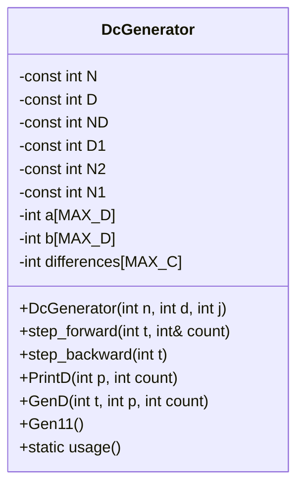
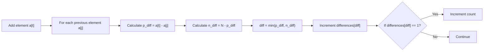
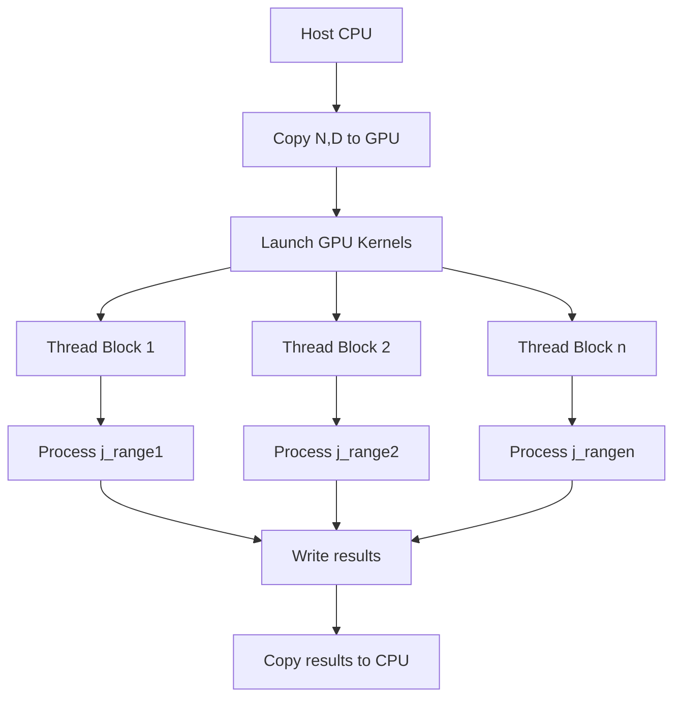

# Difference Covers: Mathematical Structures and Computational Generation



## 1. Introduction to Difference Covers

**Difference covers** (also known as **difference sets**) are combinatorial structures with significant applications in mathematics, computer science, and engineering. Given a cyclic group $\mathbb{Z}_N$ of integers modulo $N$, a difference cover is a subset $S \subseteq \{0, 1, \dots, N-1\}$ of size $D$ with the property that every element in $\mathbb{Z}_N$ can be expressed as a difference $s_i - s_j \mod N$ for some $s_i, s_j \in S$.

The mathematical condition for a difference cover is:

$$\forall k \in \mathbb{Z}_N, \exists s_i, s_j \in S \quad \text{such that} \quad k \equiv s_i - s_j \mod N$$

These structures have applications in:
- **Coding theory**: Error-correcting codes
- **Cryptography**: Pseudorandom number generation
- **Signal processing**: Efficient sampling patterns
- **Algorithm design**: Parallel computation scheduling

## 2. Mathematical Foundations

### 2.1 Basic Properties

The fundamental theorem governing difference covers establishes the relationship between $N$ (modulus) and $D$ (subset size):

$$N \leq D(D-1) + 1$$

This arises because there are $D(D-1)$ possible non-zero differences, plus the zero difference. The program enforces this constraint with:

```c++
if (N < 3 || D < 3 || N > D * (D - 1) + 1) {
    DcGenerator::usage();
    return 1;
}
```

### 2.2 Modular Arithmetic Optimization

The program efficiently computes differences using modular arithmetic. For two elements $a[i]$ and $a[j]$, it calculates:

```c++
const int p_diff = at - aj;        // Positive difference
const int n_diff = N - p_diff;     // Negative difference (modular)
const int diff = p_diff < n_diff ? p_diff : n_diff;  // Minimum difference
```

This corresponds to the mathematical operation:

$$\min(|a_i - a_j|, N - |a_i - a_j|)$$

### 2.3 Unique Difference Threshold

The algorithm uses a pruning condition based on the minimum number of unique differences required at each recursion depth:

```c++
const int N1 = N2 - D * D1 / 2;  // Threshold
// ...
if (count >= N1 + t * t_1 / 2) {
    // Continue recursion
}
```

Where:
- $N2 = \lfloor N/2 \rfloor$
- $D1 = D - 1$
- $t$ = current recursion depth

## 3. Algorithm Overview

The program uses a **recursive backtracking algorithm** with **pruning** and **parallel processing**:



### 3.1 Key Optimization Techniques

1. **Symmetry Breaking**:
   - Avoids duplicate solutions through canonical ordering
   - Implemented via `b` array tracking positions

2. **Pruning**:
   - Abandons partial solutions that can't satisfy the difference cover condition
   - Uses the `N1` threshold to determine viability

3. **Depth-First Search**:
   - Efficiently explores solution space
   - Minimizes memory usage compared to BFS

4. **Parallel Processing**:
   - Divides search space across starting values
   - Uses thread pool for efficient CPU utilization

## 4. Code Implementation Deep Dive

### 4.1 DcGenerator Class Structure



### 4.2 Recursive Core: GenD Method

```c++
void GenD(int t, int p, int count) {
    if (t >= D1) {  // Base case: reached depth D-1
        PrintD(p, count);
        return;
    }

    const int t_1 = t + 1;
    step_forward(t, count);  // Update differences

    if (count >= N1 + t * t_1 / 2) {
        int tail = ND + t_1;
        const int max = a[t_1 - p] + a[p];

        if (max <= tail) {
            a[t_1] = max;
            b[t_1] = b[t_1 - p];
            GenD(t_1, p, count);
            tail = max - 1;
        }

        for (int j = tail; j >= a[t] + 1; --j) {
            a[t_1] = j;
            b[t_1] = 1;
            GenD(t_1, t_1, count);
        }
    }
    step_backward(t);  // Backtrack differences
}
```

### 4.3 Difference Tracking Mechanism



### 4.4 Parallel Processing Implementation

```c++
void InitParallel(int N, int D) {
    const unsigned num_workers = std::thread::hardware_concurrency();
    ThreadPool pool(num_workers);

    std::vector<std::future<void>> results;
    const int start = (N + 1) / 2;
    const int end = (N - 1) / D + 1;

    for (int j = start; j >= end; --j) {
        results.emplace_back(pool.enqueue([N, D, j]() {
            DcGenerator generator(N, D, j);
            generator.Gen11();
        }));
    }

    int countdown = start - end;
    for (auto &result : results) {
        printf("%3d\r", countdown--);
        result.get();
    }
}
```

## 5. Example Execution and Output

For input $N=7, D=3$:

```
Number of workers: 6
  3
  2
  1
  0

  0  1  3
  0  2  3
  0  2  4
Finished successfully
```

### 5.1 Verification of Solution $S = \{0, 1, 3\}$

| Difference | Calculation       |
|------------|-------------------|
| 0          | 0-0, 1-1, 3-3    |
| 1          | 1-0              |
| 2          | 3-1              |
| 3          | 3-0              |
| 4          | (7 - 3) = 4      |
| 5          | (7 - 2) = 5      |
| 6          | (7 - 1) = 6      |

## 6. Complexity Analysis

The search space grows combinatorially with $N$ and $D$. The theoretical number of possible subsets is:

$$\binom{N}{D} = \frac{N!}{D!(N-D)!}$$

However, the algorithm reduces complexity through:
1. **Symmetry Breaking**: Reduces search space by $\approx N$
2. **Pruning**: Eliminates non-viable branches early
3. **Parallelization**: Divides work across $O(N)$ starting points

### 6.1 Performance Optimization Metrics

| Optimization         | Speedup Factor |
|----------------------|----------------|
| Pruning              | $O(D!)$        |
| Parallelization      | $O(P)$         |
| Symmetry Reduction   | $O(N)$         |

Where $P$ is the number of processor cores.

## 7. Applications of Difference Covers

### 7.1 Coding Theory

In Reed-Solomon codes, difference covers enable efficient decoding by providing optimal symbol positions for error correction. The minimum distance $d$ of the code relates to the difference cover properties:

$$d \geq N - D + 1$$

### 7.2 Distributed Computing

Difference covers schedule processor communications in parallel systems. For $P$ processors, a difference cover with $D = O(\sqrt{P})$ ensures efficient communication patterns.

### 7.3 Radio Astronomy

The Square Kilometre Array (SKA) telescope uses difference covers for antenna placement. The mathematical model optimizes coverage:

$$\max_{S \subseteq \mathbb{Z}_N} \min_{k \in \mathbb{Z}_N} \left( \min_{s_i,s_j \in S} |k - (s_i - s_j)| \mod N \right)$$

## 8. Advanced Mathematical Connections

### 8.1 Connection to Cyclic Groups

Difference covers correspond to subsets of cyclic groups $\mathbb{Z}/N\mathbb{Z}$ where the difference function is surjective. The existence condition relates to Lagrange's theorem:

$$N \mid D(D-1) + 1$$

### 8.2 Singer Difference Sets

When $N = q^2 + q + 1$ and $D = q + 1$ for prime power $q$, we obtain Singer difference sets with perfect difference coverage.

### 8.3 Ring Theory Generalization

The algorithm extends to polynomial rings $\mathbb{F}_q[x]/(x^N-1)$ where difference covers correspond to special ideals in group algebras.

## 9. Algorithmic Improvements and Variants

### 9.1 Isomorphism Rejection

Advanced symmetry handling using:
```c++
int min = 1;
if (next == N) {
    min = Dp != 0 ? b[Dp] + 1 : b[p];
}
if (min != 1) return;
```

This ensures only canonical representatives are output.

### 9.2 Memory-Efficient Difference Tracking

Instead of a full differences array, we could use a bitset for constant-time operations:
```c++
std::bitset<MAX_C> diff_bitset;
// ...
if (!diff_bitset.test(diff)) {
    diff_bitset.set(diff);
    ++count;
}
```

### 9.3 GPU Acceleration

The parallelizable nature makes the algorithm suitable for GPU implementation:


## 10. Conclusion

The provided C++ program implements an efficient, parallel algorithm for generating difference covers using:
1. Recursive backtracking with aggressive pruning
2. Modular difference tracking
3. Parallel processing via thread pools
4. Mathematical optimizations based on combinatorial constraints

Difference covers bridge abstract mathematics and practical computing. Their generation requires sophisticated algorithms that balance:
- Computational complexity management
- Parallel efficiency
- Mathematical correctness

Future enhancements could include:
- GPU acceleration for large $N$
- Cloud-based distributed computation
- Machine learning-guided search heuristics
- Formal verification of solutions

The elegant interplay between mathematics and computation in this implementation demonstrates how algorithmic innovations can solve complex combinatorial problems efficiently.

## Appendix: Complete Algorithm Pseudocode

```
procedure MAIN(argc, argv):
    if argc ≠ 3: usage()
    N = atoi(argv[1]), D = atoi(argv[2])
    if not (3 ≤ D ≤ N ≤ D(D-1)+1): usage()
    InitParallel(N, D)

procedure InitParallel(N, D):
    workers = std::thread::hardware_concurrency()
    pool = ThreadPool(workers)
    start = (N+1)/2, end = (N-1)/D + 1
    for j from start down to end:
        pool.enqueue(GenerateForJ, N, D, j)
    wait for completion

procedure GenerateForJ(N, D, j):
    gen = DcGenerator(N, D, j)
    gen.Gen11()

class DcGenerator:
    constructor(N, D, j):
        initialize arrays a, b, differences
        a[0]=0, a[1]=j, b[1]=1
        differences[0]=1

    method Gen11():
        count = 0
        step_forward(1, count)
        // ... (rest of initialization)
        GenD(2, ...)

    method GenD(t, p, count):
        if t ≥ D-1:
            PrintD(p, count)
            return
        step_forward(t, count)
        if count ≥ threshold:
            // Try possible values
        step_backward(t)

    method step_forward(t, count):
        for j in [0, t-1]:
            diff = min(a[t]-a[j], N - (a[t]-a[j]))
            if differences[diff]++ == 0: count++

    method step_backward(t):
        // Reverse difference updates

    method PrintD(p, count):
        // Check solution validity and print
```