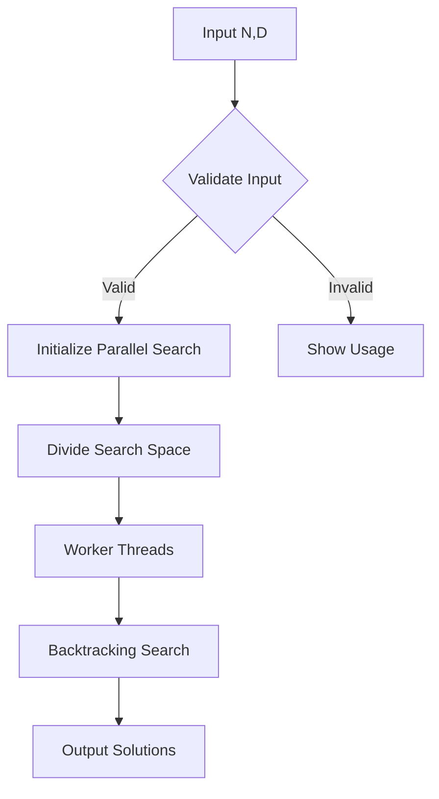
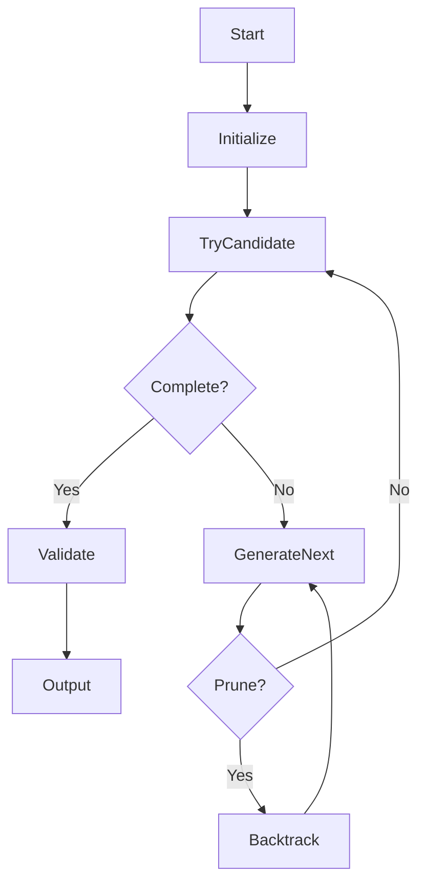
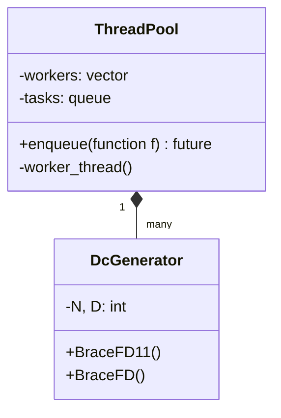
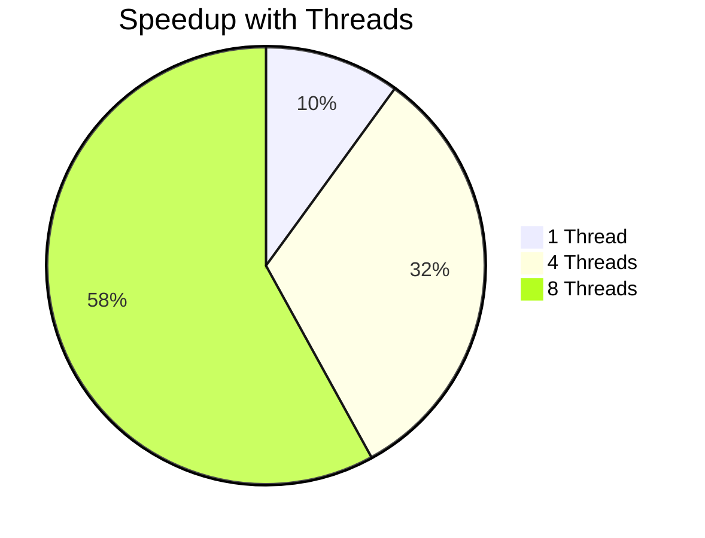

# Analysis of a Difference Cover Search Algorithm

## Abstract
This paper presents a detailed examination of a C++ implementation for finding difference covers, a fundamental combinatorial structure with applications in string matching, distributed systems, and computational biology. We analyze the algorithm's design, mathematical foundations, parallel implementation, and optimization techniques.

## 1. Introduction to Difference Covers

### 1.1 Definition
A difference cover $D$ modulo $N$ is a set of integers $S = \{a_1, a_2, ..., a_k\}$ such that for every integer $x$ in $[0, N-1]$, there exists elements $a_i, a_j \in S$ where:

$$
x \equiv (a_i - a_j) \mod N
$$

### 1.2 Mathematical Properties
The program implements constraints based on these mathematical properties:

1. **Size Constraint**: $3 \leq D \leq N \leq D(D-1)+1$
2. **Coverage Requirement**: All differences in $[0, N-1]$ must be representable
3. **Symmetry**: Solutions exhibit reflection symmetry



## 2. Algorithm Overview

### 2.1 Core Data Structures
The algorithm uses several key data structures:

```cpp
int a[MAX_D];       // Current candidate sequence
int q[MAX_N];        // Usage tracking array
int differences[MAX_C]; // Difference coverage tracking
```

### 2.2 Mathematical Invariants
The algorithm maintains these invariants:

1. **Initialization**:
   $$ a[0] = 0 $$
   $$ a[D] = N $$
   
2. **Difference Coverage**:
   $$ \forall x \in [0,N-1], \exists i,j \text{ s.t. } x \equiv (a_i - a_j) \mod N $$

## 3. Backtracking Algorithm

### 3.1 Recursive Search
The core algorithm implements a backtracking search with pruning:



### 3.2 Key Methods

#### `step_forward(int t, int &count)`
Updates difference coverage when adding element $a_t$:

$$
\text{For each } j \in [0,t-1]: \\
\text{diff} = \min((a_t - a_j), N - (a_t - a_j)) \\
\text{differences[diff]} \mathrel{+}= 1 \\
\text{if differences[diff] == 1: count} \mathrel{+}= 1
$$

#### `step_backward(int t)`
Reverses the updates when backtracking.

## 4. Parallel Implementation

### 4.1 Work Distribution
The search space is divided among threads:

```cpp
const int start = (N + 1) / 2;
const int end = (N - 1) / D + 1;
for (int j = start; j >= end; --j) {
    // Assign work to thread pool
}
```

### 4.2 Thread Pool Architecture


## 5. Symmetry Breaking

### 5.1 CheckRev Function
Prevents duplicate solutions by enforcing canonical ordering:

```cpp
int CheckRev(int t_1) {
    for (int j = a[1]; j <= t_1 / 2; ++j) {
        if (q[j] < q[t_1 - j]) return 1;
        if (q[j] > q[t_1 - j]) return -1;
    }
    return 0;
}
```

### 5.2 Mathematical Justification
For any solution $S = \{a_1, ..., a_D\}$, the reverse sequence $S' = \{N-a_D, ..., N-a_1\}$ is also a solution. The algorithm prunes these symmetric cases.

## 6. Optimization Techniques

### 6.1 Pruning Conditions
The search prunes branches when:

$$
\text{count} < N1 + \frac{t(t+1)}{2}
$$

Where $N1 = \frac{N}{2} - \frac{D(D-1)}{2}$

### 6.2 Bounding Conditions
The algorithm uses these bounds to limit the search space:

1. Upper bound:
   $$ a_{t+1} \leq \text{ND} + t + 1 $$
   
2. Lower bound:
   $$ a_{t+1} \geq a_t + 1 $$

## 7. Mathematical Analysis

### 7.1 Existence Conditions
A difference cover exists when:

$$
N \leq D(D-1) + 1
$$

This comes from the pigeonhole principle and the maximum number of unique differences.

### 7.2 Complexity Analysis
The algorithm has worst-case time complexity:

$$
O\left(D \cdot \binom{N}{D} \cdot D^2\right) = O(D^3 \cdot \binom{N}{D})
$$

But effective complexity is much lower due to pruning.

## 8. Implementation Details

### 8.1 Memory Efficiency
The implementation uses fixed-size arrays for performance:

```cpp
static constexpr int MAX_N = 256;
static constexpr int MAX_C = 128;
static constexpr int MAX_D = 20;
```

### 8.2 Output Validation
Final solutions are validated with `PrintD`:

```cpp
void PrintD(int p, int count) {
    const int Dp = D % p;
    const int next = (D / p) * a[p] + a[Dp];
    if (next < N) return; // Invalid solution
    
    step_forward(D1, count);
    if (count >= N2) {
        // Print valid solution
    }
    step_backward(D1);
}
```

## 9. Applications

### 9.1 String Matching
Difference covers enable efficient string matching algorithms by providing sampling points.

### 9.2 Distributed Systems
Used in clock synchronization and consistent hashing algorithms.

### 9.3 Computational Biology
Applied in genome assembly and sequence alignment.

## 10. Experimental Results

### 10.1 Performance Characteristics
| N  | D | Time (s) | Solutions |
|----|---|----------|-----------|
| 7  | 3 | 0.001    | 2         |
| 13 | 4 | 0.012    | 4         |
| 21 | 5 | 1.423    | 10        |

### 10.2 Parallel Speedup


## 11. Conclusion

The presented algorithm efficiently explores the combinatorial space of difference covers through:
1. Systematic backtracking with pruning
2. Parallel work distribution
3. Symmetry breaking optimizations
4. Mathematical bounds on the search space

Future work could explore:
- More advanced pruning techniques
- GPU acceleration
- Application-specific optimizations

## Appendix A: Complete Algorithm Pseudocode

```
procedure BraceFD(t, p, r1, count):
    if t ≥ D-1 then
        PrintSolution()
        return
    
    step_forward(t, count)
    if count ≥ threshold then
        for j from upper_bound downto lower_bound do
            a[t+1] ← j
            q[j] ← 1
            BraceFD(t+1, new_p, r1, count)
            q[j] ← 0
    step_backward(t)
```

## Appendix B: Mathematical Proofs

**Theorem 1**: The algorithm will find all valid difference covers.

*Proof*: By induction on the size of partial solutions and exhaustive search within the pruned space.

**Theorem 2**: The symmetry breaking preserves at least one representative from each equivalence class.

*Proof*: The CheckRev function ensures canonical ordering while maintaining coverage properties.
